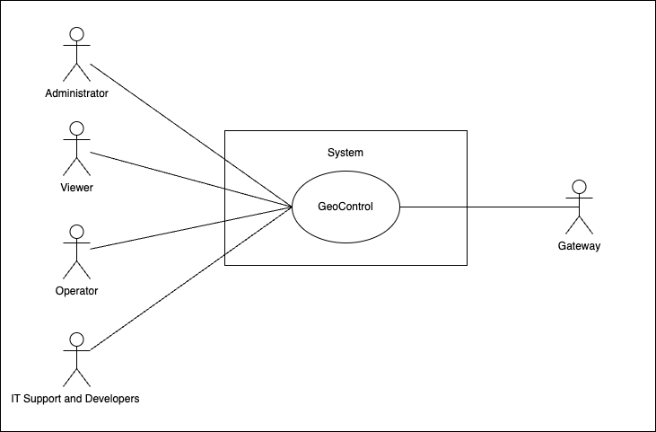
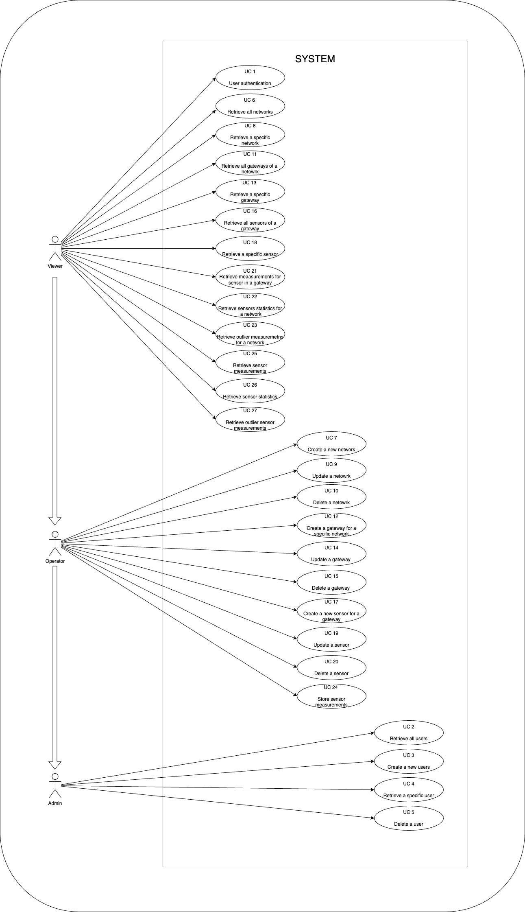
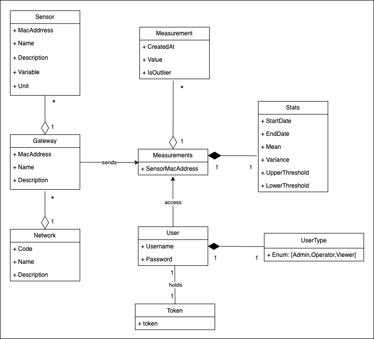
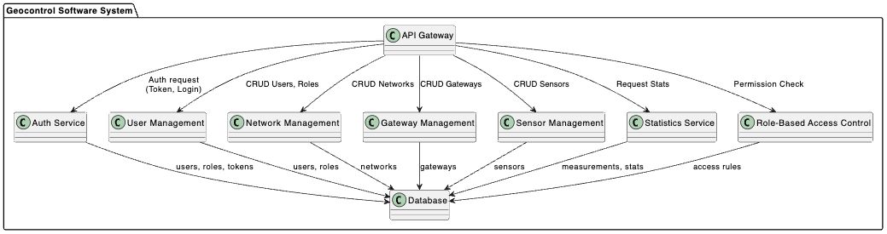
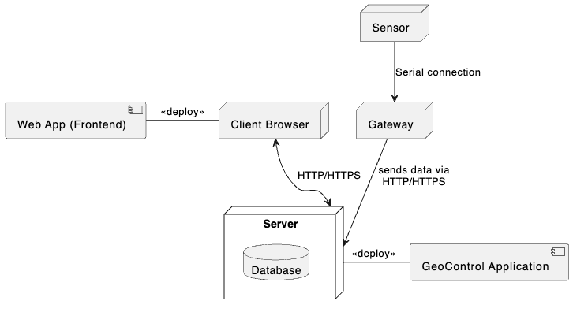

# Requirements Document - GeoControl

Date: 15/4/2025

Version: V1 - description of Geocontrol as described in the swagger

| Version number | Change |
| :------------: | :----: |
|                |        |

# Contents

- [Requirements Document - GeoControl](#requirements-document---geocontrol)
- [Contents](#contents)
- [Informal description](#informal-description)
- [Business model](#business-model)
- [Stakeholders](#stakeholders)
- [Context Diagram and interfaces](#context-diagram-and-interfaces)
  - [Context Diagram](#context-diagram)
  - [Interfaces](#interfaces)
- [Stories and personas](#stories-and-personas)
- [Functional and non functional requirements](#functional-and-non-functional-requirements)
  - [Functional Requirements](#functional-requirements)
  - [Non Functional Requirements](#non-functional-requirements)
- [Use case diagram and use cases](#use-case-diagram-and-use-cases)

  - [Use case diagram](#use-case-diagram)

  - [Use Case 1 (UC1): User Authentication](#use-case-1-uc1-user-authentication)

    - [Scenario 1.1: Successful authentication (200)](#scenario-11-successful-authentication-200)
    - [Scenario 1.2: Invalid input (400)](#scenario-12-invalid-input-400)
    - [Scenario 1.3: Wrong username or password (401)](#scenario-13-wrong-username-or-password-401)
    - [Scenario 1.4: User not found (404)](#scenario-14-user-not-found-404)
    - [Scenario 1.5: Internal server error (500)](#scenario-15-internal-server-error-500)

  - [Use Case 2 (UC2): Retrieve All Users](#use-case-2-uc2-retrieve-all-users)

    - [Scenario 2.1: Successful users list retrieval (200)](#scenario-21-successful-users-list-retrieval-200)
    - [Scenario 2.2: Unauthorized (401)](#scenario-22-unauthorized-401)
    - [Scenario 2.3: Insufficient rights (403)](#scenario-23-insufficient-rights-403)
    - [Scenario 2.4: Internal server error (500)](#scenario-24-internal-server-error-500)

  - [Use Case 3 (UC3): Create a New User](#use-case-3-uc3-create-a-new-user)

    - [Scenario 3.1: Successful user creation (201)](#scenario-31-successful-user-creation-201)
    - [Scenario 3.2: Invalid input data (400)](#scenario-32-invalid-input-data-400)
    - [Scenario 3.3: Unauthorized (401)](#scenario-33-unauthorized-401)
    - [Scenario 3.4: Insufficient rights (403)](#scenario-34-insufficient-rights-403)
    - [Scenario 3.5: Username already in use (409)](#scenario-35-username-already-in-use-409)
    - [Scenario 3.6: Internal server error (500)](#scenario-36-internal-server-error-500)

  - [Use Case 4 (UC4): Retrieve a Specific User](#use-case-4-uc4-retrieve-a-specific-user)

    - [Scenario 4.1: Successful user retrieval (200)](#scenario-41-successful-user-retrieval-200)
    - [Scenario 4.2: Unauthorized (401)](#scenario-42-unauthorized-401)
    - [Scenario 4.3: Insufficient rights (403)](#scenario-43-insufficient-rights-403)
    - [Scenario 4.4: User not found (404)](#scenario-44-user-not-found-404)
    - [Scenario 4.5: Internal server error (500)](#scenario-45-internal-server-error-500)

  - [Use Case 5 (UC5): Delete a User](#use-case-5-uc5-delete-a-user)

    - [Scenario 5.1: Successful user deletion (204)](#scenario-51-successful-user-deletion-204)
    - [Scenario 5.2: Unauthorized (401)](#scenario-52-unauthorized-401)
    - [Scenario 5.3: Insufficient rights (403)](#scenario-53-insufficient-rights-403)
    - [Scenario 5.4: User not found (404)](#scenario-54-user-not-found-404)
    - [Scenario 5.5: Internal server error (500)](#scenario-55-internal-server-error-500)

  - [Use Case 6 (UC6): Retrieve all networks](#use-case-6-uc6-retrieve-all-networks)

    - [Scenario 6.1: Successful networks retrieval (200)](#scenario-61-successful-networks-retrieval-200)
    - [Scenario 6.2: Unauthorized (401)](#scenario-62-unauthorized-401)
    - [Scenario 6.3: Internal server error (500)](#scenario-63-internal-server-error-500)

  - [Use Case 7: Create a new network](#use-case-7-create-a-new-network)

    - [Scenario 7.1 - Network created (201)](#scenario-71---network-created-201)
    - [Scenario 7.2 - Invalid input data (400)](#scenario-72---invalid-input-data-400)
    - [Scenario 7.3 - Unauthorized (401)](#scenario-73---unauthorized-401)
    - [Scenario 7.4 - Insufficient rights (403)](#scenario-74---insufficient-rights-403)
    - [Scenario 7.5 - Network code already in use (409)](#scenario-75---network-code-already-in-use-409)
    - [Scenario 7.6 - Internal server error (500)](#scenario-76---internal-server-error-500)

  - [Use Case 8: Retrieve a specific network](#use-case-8-retrieve-a-specific-network)

    - [Scenario 8.1 - Successful authentication and single network retrieval (200)](#scenario-81---successful-authentication-and-single-network-retrieval-200)
    - [Scenario 8.2 - Unauthorized access (401)](#scenario-82---unauthorized-access-401)
    - [Scenario 8.3 - Network not found (404)](#scenario-83---network-not-found-404)
    - [Scenario 8.4 - Internal server error (500)](#scenario-84---internal-server-error-500)

  - [Use Case 9: Update a network](#use-case-9-update-a-network)

    - [Scenario 9.1 - Network updated (204)](#scenario-91---network-updated-204)
    - [Scenario 9.2 - Invalid input data (400)](#scenario-92---invalid-input-data-400)
    - [Scenario 9.3 - Unauthorized access (401)](#scenario-93---unauthorized-access-401)
    - [Scenario 9.4 - Insufficient rights (403)](#scenario-94---insufficient-rights-403)
    - [Scenario 9.5 - Network not found (404)](#scenario-95---network-not-found-404)
    - [Scenario 9.6 - Network code already in use (409)](#scenario-96---network-code-already-in-use-409)
    - [Scenario 9.7 - Internal server error (500)](#scenario-97---internal-server-error-500)

  - [Use Case 10: Delete a network](#use-case-10-delete-a-network)

    - [Scenario 10.1 - Network deleted (204)](#scenario-101---network-deleted-204)
    - [Scenario 10.2 - Unauthorized access (401)](#scenario-102---unauthorized-access-401)
    - [Scenario 10.3 - Insufficient rights (403)](#scenario-103---insufficient-rights-403)
    - [Scenario 10.4 - Network not found (404)](#scenario-104---network-not-found-404)
    - [Scenario 10.5 - Internal server error (500)](#scenario-105---internal-server-error-500)

  - [Use Case 11: Retrieve all gateways of a network](#use-case-11-retrieve-all-gateways-of-a-network)

    - [Scenario 11.1 - Retrieve list of all Gateways (200)](#scenario-111---retrieve-list-of-all-gateways-200)
    - [Scenario 11.2 - Unauthorized Access (401)](#scenario-112---unauthorized-access-401)
    - [Scenario 11.3 - Network Not Found (404)](#scenario-113---network-not-found-404)
    - [Scenario 11.4 - Server error (500)](#scenario-114---server-error-500)

  - [Use Case 12: Gateway Creation for a Specific Network](#use-case-12-gateway-creation-for-a-specific-network)

    - [Scenario 12.1 Success (200)](#scenario-121-success-200)
    - [Scenario 12.2 Invalid Input Data (400)](#scenario-122-invalid-input-data-400)
    - [Scenario 12.3 Unauthorized Access (Invalid Token)](#scenario-123-unauthorized-access-invalid-token)
    - [Scenario 12.4 Insufficient Rights](#scenario-124-insufficient-rights)
    - [Scenario 12.5 Network Not Found](#scenario-125-network-not-found)
    - [Scenario 12.6 Internal Server Error](#scenario-126-internal-server-error)

  - [Use Case 13: Retrieve a specific Gateway](#use-case-13-retrieve-a-specific-gateway)

    - [Scenario 13.1 Success (200)](#scenario-131-success-200)
    - [Scenario 13.2 Unauthorized (401)](#scenario-132-unauthorized-401)
    - [Scenario 13.3 Network/Gateway Not Found (404)](#scenario-133-networkgateway-not-found-404)
    - [Scenario 13.4 Internal Server Error (500)](#scenario-134-internal-server-error-500)

  - [Use Case 14: Update a Gateway](#use-case-14-update-a-gateway)

    - [Scenario 14.1 Gateway Updated (204)](#scenario-141-gateway-updated-204)
    - [Scenario 14.2 Invalid Input Data (400)](#scenario-142-invalid-input-data-400)
    - [Scenario 14.3 Unauthorized (401)](#scenario-143-unauthorized-401)
    - [Scenario 14.4 Insufficient Rights (403)](#scenario-144-insufficient-rights-403)
    - [Scenario 14.5 Network/Gateway Not Found (404)](#scenario-145-networkgateway-not-found-404)
    - [Scenario 14.6 Gateway MAC Address Already in Use (409)](#scenario-146-gateway-mac-address-already-in-use-409)
    - [Scenario 14.7 Internal Server Error (500)](#scenario-147-internal-server-error-500)

  - [Use Case 15: Delete a Gateway](#use-case-15-delete-a-gateway)

    - [Scenario 15.1: Successful gateway deletion (204)](#scenario-151-successful-gateway-deletion-204)
    - [Scenario 15.2: Unauthorized access (401)](#scenario-152-unauthorized-access-401)
    - [Scenario 15.3: Insufficient rights (403)](#scenario-153-insufficient-rights-403)
    - [Scenario 15.4: Network or Gateway not found (404)](#scenario-154-network-or-gateway-not-found-404)
    - [Scenario 15.5: Internal server error (500)](#scenario-155-internal-server-error-500)

  - [Use Case 16: Retrieve All Sensors of a Gateway](#use-case-16-retrieve-all-sensors-of-a-gateway)

    - [Scenario 16.1: Successful sensor list retrieval (200)](#scenario-161-successful-sensor-list-retrieval-200)
    - [Scenario 16.2: Unauthorized access (401)](#scenario-162-unauthorized-access-401)
    - [Scenario 16.3: Network or Gateway not found (404)](#scenario-163-network-or-gateway-not-found-404)
    - [Scenario 16.4: Internal server error (500)](#scenario-164-internal-server-error-500)

  - [Use Case 17: Create a New Sensor for a Gateway](#use-case-17-create-a-new-sensor-for-a-gateway)

    - [Scenario 17.1: Successful sensor creation (201)](#scenario-171-successful-sensor-creation-201)
    - [Scenario 17.2: Invalid input (400)](#scenario-172-invalid-input-400)
    - [Scenario 17.3: Unauthorized access (401)](#scenario-173-unauthorized-access-401)
    - [Scenario 17.4: Insufficient rights (403)](#scenario-174-insufficient-rights-403)
    - [Scenario 17.5: Network or Gateway not found (404)](#scenario-175-network-or-gateway-not-found-404)
    - [Scenario 17.6: Sensor MAC already in use (409)](#scenario-176-sensor-mac-already-in-use-409)
    - [Scenario 17.7: Internal server error (500)](#scenario-177-internal-server-error-500)

  - [Use Case 18: Retrieve a Specific Sensor](#use-case-18-retrieve-a-specific-sensor)

    - [Scenario 18.1: Successful sensor retrieval (200)](#scenario-181-successful-sensor-retrieval-200)
    - [Scenario 18.2: Unauthorized access (401)](#scenario-182-unauthorized-access-401)
    - [Scenario 18.3: Network, Gateway, or Sensor not found (404)](#scenario-183-network-gateway-or-sensor-not-found-404)
    - [Scenario 18.4: Internal server error (500)](#scenario-184-internal-server-error-500)

  - [Use Case 19: Update a Sensor](#use-case-19-update-a-sensor)

    - [Scenario 19.1: Successful sensor update (204)](#scenario-191-successful-sensor-update-204)
    - [Scenario 19.2: Invalid input (400)](#scenario-192-invalid-input-400)
    - [Scenario 19.3: Unauthorized access (401)](#scenario-193-unauthorized-access-401)
    - [Scenario 19.4: Insufficient rights (403)](#scenario-194-insufficient-rights-403)
    - [Scenario 19.5: Network, Gateway, or Sensor not found (404)](#scenario-195-network-gateway-or-sensor-not-found-404)
    - [Scenario 19.6: Sensor MAC already in use (409)](#scenario-196-sensor-mac-already-in-use-409)
    - [Scenario 19.7: Internal server error (500)](#scenario-197-internal-server-error-500)

  - [Use Case 20: Delete a Sensor](#use-case-20-delete-a-sensor)

    - [Scenario 20.1: Successful sensor deletion (204)](#scenario-201-successful-sensor-deletion-204)
    - [Scenario 20.2: Unauthorized access (401)](#scenario-202-unauthorized-access-401)
    - [Scenario 20.3: Insufficient rights (403)](#scenario-203-insufficient-rights-403)
    - [Scenario 20.4: Network, Gateway, or Sensor not found (404)](#scenario-204-network-gateway-or-sensor-not-found-404)
    - [Scenario 20.5: Internal server error (500)](#scenario-205-internal-server-error-500)

  - [Use Case 21: Retrieve Measurements for Sensors in a Network](#use-case-21-retrieve-measurements-for-sensors-in-a-network)

    - [Scenario 21.1: Successful authentication and data retrieval (200)](#scenario-211-successful-authentication-and-data-retrieval-200)
    - [Scenario 21.2: Unauthorized access (401)](#scenario-212-unauthorized-access-401)
    - [Scenario 21.3: Network not found (404)](#scenario-213-network-not-found-404)
    - [Scenario 21.4: Internal server error (500)](#scenario-214-internal-server-error-500)

  - [Use Case 22: Retrieve sensor statistics for a network](#use-case-22-retrieve-sensor-statistics-for-a-network)

    - [Scenario 22.1: Successful statistics retrieval (200)](#scenario-221-successful-statistics-retrieval-200)
    - [Scenario 22.2: Unauthorized access (401)](#scenario-222-unauthorized-access-401)
    - [Scenario 22.3: Network not found (404)](#scenario-223-network-not-found-404)
    - [Scenario 22.4: Internal server error (500)](#scenario-224-internal-server-error-500)

  - [Use Case 23: Retrieve outlier measurements for a network](#use-case-23-retrieve-outlier-measurements-for-a-network)

    - [Scenario 23.1: Successful outlier retrieval (200)](#scenario-231-successful-outlier-retrieval-200)
    - [Scenario 23.2: Unauthorized access (401)](#scenario-232-unauthorized-access-401)
    - [Scenario 23.3: Network not found (404)](#scenario-233-network-not-found-404)
    - [Scenario 23.4: Internal server error (500)](#scenario-234-internal-server-error-500)

  - [Use Case 24: Store sensor measurements](#use-case-24-store-sensor-measurements)

    - [Scenario 24.1: Successful measurement storage (201)](#scenario-241-successful-measurement-storage-201)
    - [Scenario 24.2: Invalid input data (400)](#scenario-242-invalid-input-data-400)
    - [Scenario 24.3: Unauthorized access (401)](#scenario-243-unauthorized-access-401)
    - [Scenario 24.4: Insufficient rights (403)](#scenario-244-insufficient-rights-403)
    - [Scenario 24.5: Network, Gateway, or Sensor not found (404)](#scenario-245-network-gateway-or-sensor-not-found-404)
    - [Scenario 24.6: Internal server error (500)](#scenario-246-internal-server-error-500)

  - [Use Case 25: Retrieve sensor measurements](#use-case-25-retrieve-sensor-measurements)

    - [Scenario 25.1: Successful measurement retrieval (200)](#scenario-251-successful-measurement-retrieval-200)
    - [Scenario 25.2: Unauthorized access (401)](#scenario-252-unauthorized-access-401)
    - [Scenario 25.3: Resource not found (404)](#scenario-253-resource-not-found-404)
    - [Scenario 25.4: Internal server error (500)](#scenario-254-internal-server-error-500)

  - [Use Case 26: Retrieve sensor statistics](#use-case-26-retrieve-sensor-statistics)

    - [Scenario 26.1: Successful statistics retrieval (200)](#scenario-261-successful-statistics-retrieval-200)
    - [Scenario 26.2: Unauthorized access (401)](#scenario-262-unauthorized-access-401)
    - [Scenario 26.3: Resource not found (404)](#scenario-263-resource-not-found-404)
    - [Scenario 26.4: Internal server error (500)](#scenario-264-internal-server-error-500)

  - [Use Case 27: Retrieve outlier sensor measurements](#use-case-27-retrieve-outlier-sensor-measurements)
    - [Scenario 27.1: Successful outlier measurements retrieval (200)](#scenario-271-successful-outlier-measurements-retrieval-200)
    - [Scenario 27.2: Unauthorized access (401)](#scenario-272-unauthorized-access-401)
    - [Scenario 27.3: Resource not found (404)](#scenario-273-resource-not-found-404)
    - [Scenario 27.4: Internal server error (500)](#scenario-274-internal-server-error-500)

- [Glossary](#glossary)
- [System Design](#system-design)
- [Deployment Diagram](#deployment-diagram)

# Informal description

GeoControl is a software system designed for monitoring physical and environmental variables in various contexts: from hydrogeological analyses of mountain areas to the surveillance of historical buildings, and even the control of internal parameters (such as temperature or lighting) in residential or working environments.

# Business Model

GeoControl operates as a **subscription-based B2B SaaS platform**, offering continuous monitoring of physical and environmental parameters. The service is accessible via the internet, with a **recurring payment model**. Customers include **public institutions, private companies, and research organizations** that require real-time environmental monitoring and historical data analysis.

GeoControl offers two subscription pans:  
**Annual** – Provides full access to real-time and historical data, as well as statistical analysis tools for a 12 month period.  
**Seasonal** – Provides full access to real-time and historical data, as well as statistical analysis tools for a 4 month period.

# Stakeholders

| Stakeholder name          | Description                                                                                                                                                                                                 |
| ------------------------- | ----------------------------------------------------------------------------------------------------------------------------------------------------------------------------------------------------------- |
| Commissioning body        | Union of Mountain Communities of the Piedmont: the original client, responsible for funding the system’s development.                                                                                       |
| Viwers                    | End Users: municipalities, engineering firms, heritage conservation teams, and smart-building managers. Utilize GeoControl for monitoring, alerts, and data-driven decision-making.                         |
| Administrators            | Has full access to all resources and manages user accounts and network.                                                                                                                                     |
| Operators                 | Configures and manages networks, gateways, and sensors. Can insert measurements but has no access to user-related functionalities.                                                                          |
| IT Support and Developers | Maintain system performance, software updates, and API enhancements. Address security vulnerabilities and ensure compliance with data governance policies. Are provided with admin-realted functionalities. |

# Context Diagram and interfaces

## Context Diagram

## Interfaces

| Actor             | Logical Interface | Physical Interface |
| ----------------- | ----------------- | ------------------ |
| Viewer            | GUI               | Smartphone/PC      |
| Admin             | GUI               | PC                 |
| Operator          | GUI               | PC                 |
| Support/Developer | GUI               | PC                 |
| Gateway           | HTTP APIs         | Network Interface  |

# Stories and personas

## Persona 1: Giovanni – The System Administrator

**Role**: Admin  
**Background**: Giovanni works for the Union of Mountain Communities in Piedmont. With a strong understanding of both administrative protocols and IT systems, he is responsible for overseeing the overall configuration and access control of GeoControl across multiple municipalities.

**Responsibilities**:

- Manages user accounts and access roles
- Sets up and maintains monitoring networks
- Ensures system security and data governance

**Story**:  
Giovanni accesses the GeoControl web portal using his admin credentials. From the dashboard, he navigates to the "Users" section to create new operator accounts for a field team scheduled to install sensors in a high-risk landslide area. He then configures a new network labeled "Valmont_01," assigning it to the relevant municipality. Although he doesn’t work directly with measurements, Giovanni ensures the system’s structure is ready and secure for operational use, allowing data collection and analysis to proceed smoothly.

---

## Persona 2: Giulia – The Environmental Analyst

**Role**: Viewer  
**Background**: Giulia is a geologist working for the Territorial Protection Agency. She specializes in the analysis of hydrogeological trends and provides scientific support for risk assessments in mountainous regions.

**Responsibilities**:

- Monitors environmental parameters and sensor data
- Performs data trend analysis and identifies anomalies
- Prepares reports and issues alerts for civil protection

**Story**:  
After intense rainfall in April, Giulia is tasked with monitoring the Rocca Bianca area, known for hydrogeological risk. She logs into the GeoControl platform using her credentials and receives a Bearer token for secure API access. From the dashboard, she selects the Rocca Bianca network and identifies the gateway "GW-RB-01", locating the soil moisture sensor "71:B1:CE:01:C6:A9". She queries the last 7 days of data, which the system returns in UTC and the client converts to local time.

Using the system’s analytics tools, Giulia triggers a statistical report:

- The system calculates the mean (μ) and variance (σ²)
- Thresholds are computed:
  - `upperThreshold = μ + 2σ`
  - `lowerThreshold = μ - 2σ`

Two values exceed the upper threshold and are flagged as outliers. These are shown in red on the graph and marked `"isOutlier: true"` in the CSV export. Giulia compiles this information into a report recommending the installation of a second sensor for redundancy.

---

## Persona 3: Luca – The Field Operator

**Role**: Operator  
**Background**: Luca is a technician responsible for deploying and configuring GeoControl hardware in the field. He ensures that all gateways and sensors are correctly registered and that field installations are mirrored in the system.

**Responsibilities**:

- Sets up new networks and physical gateways
- Registers and assigns sensors to corresponding gateways
- Keeps field deployments synchronized with digital configuration

**Story**:  
Luca receives a new assignment to install monitoring devices in a landslide-prone area. After logging into GeoControl with his operator credentials, he creates a network called "MonteChiaro_02". He then registers a new gateway by entering its MAC address, connects a set of soil and temperature sensors, and links each to their respective serial channels.

Once deployed, he validates that each sensor begins transmitting measurements correctly. By aligning the physical setup with the system configuration, Luca ensures reliable data flow for analysts and geologists. His work lays the groundwork for accurate and continuous monitoring.

---

## Persona 4: Marta – The IT Support and Developer

**Role**: Developer / Technical Support  
**Background**: Marta is part of the internal IT team responsible for the development, maintenance, and support of the GeoControl platform. She works closely with domain experts and end users to translate functional needs into software features.

**Responsibilities**:

- Analyzes user requests and translates them into technical tasks
- Designs and implements new features in the GeoControl system
- Maintains platform reliability through testing and deployments

**Story**:  
Marta receives a request from Giulia, an environmental analyst, asking for the ability to export measurement data in Excel format to simplify sharing in official reports. Marta reviews the request, discusses the functional details with the analyst, and defines the scope of the new feature.

After gathering the requirements, she develops an `.xlsx` export functionality within the GeoControl platform. The new feature is tested against real datasets to ensure formatting and compatibility. Once verified, it is deployed to production and made available to all users, improving data accessibility and reporting workflows across the organization.

# Functional and non functional requirements

## Functional Requirements

| ID      | Description                                                                    |
| ------- | ------------------------------------------------------------------------------ |
| FR1     | Authentication Management                                                      |
| FR1.1   | Authenticate user and return a bearer token in case the credentials are valid  |
| FR2     | Users Managemeent                                                              |
| FR2.1   | Retrieve all users                                                             |
| FR2.2   | Create a new user                                                              |
| FR2.3   | Retrieve a specific user                                                       |
| FR2.4   | Delete a users                                                                 |
| FR3     | Networks Management                                                            |
| FR3.1   | Retrieve all networks                                                          |
| FR3.2   | Create a new network                                                           |
| FR3.3   | Retrieve a specific network                                                    |
| FR3.4   | Update a netowrk                                                               |
| FR3.5   | Delete a network                                                               |
| FR4     | Gateways Management                                                            |
| FR4.1   | Retrieve all gateways for a network                                            |
| FR4.2   | Create a new gateway for a network                                             |
| FR4.3   | Retrieve a specific gateway                                                    |
| FR4.4   | Update a gateway                                                               |
| FR4.5   | Delete a gateway                                                               |
| FR5     | Sensors Management                                                             |
| FR5.1   | Retrieve all sensors for a gateway                                             |
| FR5.2   | Create a new sensor for a gateway                                              |
| FR5.3   | Retrieve a specific sensor                                                     |
| FR5.4   | Update a sensor                                                                |
| FR5.5   | Delete a sensor                                                                |
| FR6     | Measures Management                                                            |
| FR6.1   | Retrieve measurements for a set of sensors of a specific network               |
| FR6.2   | Retrieve only statistics for a set of sensors of a specific network            |
| FR6.3   | Retrieve only outliers measurements for a set of sensors of a specific network |
| FR6.4   | Store measurements for a sensor                                                |
| FR6.4.1 | Each measurement includes a numeric value and the timestamp                    |
| FR6.5   | Retrieve measurements for a specific sensor                                    |
| FR6.6   | Retrieve statistics for a specific sensor                                      |
| FR6.7   | Retrieve only outliers measurements for a specific sensor                      |
| FR7     | Calculations and Statistical Analysis                                          |
| FR7.1   | Calculate mean and variance of measurements over a given time span             |
| FR7.2   | Calculate thresholds (upper and lower) to identify potential anomalous values  |
| FR7.3   | Calculate outliers                                                             |

## Non Functional Requirements

| ID    | Type                | Description                                                                                                                               | Refers to               |
| ----- | ------------------- | ----------------------------------------------------------------------------------------------------------------------------------------- | ----------------------- |
| NFR1  | Reliability         | The system must not lose more than 6 measurements per sensor per year.                                                                    | FR6.4, FR6.4.1          |
| NFR2  | Security            | The system must use a token-based authentication mechanism.                                                                               | FR1, FR1.1              |
| NFR3  | Security            | Different user roles (Admin, Operator, Viewer) must have different access levels, with strict restrictions on private or restricted data. | FR1, FR2                |
| NFR4  | Portability         | The system must be accessible via GUI on both PC and smartphone devices.                                                                  | FR2, FR3, FR4, FR5, FR6 |
| NFR5  | Scalability         | The system must support multiple networks, gateways, and sensors thanks to a modular design.                                              | FR2, FR3, FR4, FR5, FR6 |
| NFR6  | Standard Compliance | All timestamps must be converted and stored in UTC.                                                                                       | FR6.4.1                 |
| NFR7  | Standard Compliance | Timestamps must follow the ISO 8601 standard format.                                                                                      | FR6.4.1                 |
| NFR8  | Availability        | The system must always be available to receive measurements every 10 minutes.                                                             | FR6.4, FR6.4.1          |
| NFR9  | Integrability       | The system must provide APIs to allow integration with external systems.                                                                  | all                     |
| NFR10 | Performance         | Data retrieval operations must respond in acceptable time (<2 sec).                                                                       | FR6, FR7                |

# Use case diagram and use cases

## Use case diagram

NOTE: for readability purposes, arrows between user types have been introduced. These arrows indicate that the pointed-to user type can perform all the UCs associated with the pointing one. Those arrows DO NOT represent any kind of logical inheritance.

## Use Case 1: User Authentication

| **Actors Involved**  | User (Admin, Operator, Viewer)                                                                                              |
| -------------------- | --------------------------------------------------------------------------------------------------------------------------- |
| **Precondition**     | valid username and password are provided                                                                                    |
| **Post condition**   | bearer token is issued and user session is active                                                                           |
| **Nominal Scenario** | The user submits credentials via the login interface. The system validates credentials and returns a bearer token if valid. |
| **Exceptions**       | Invalid input data, Invalid username or password, User not found, Internal server error                                     |

#### Scenario 1.1 Successful authentication (200)

|                    | Description                            |
| ------------------ | -------------------------------------- |
| **Precondition**   | Valid username and password            |
| **Post condition** | Bearer token issued and active session |

| Step# | Description                                     |
| ----- | ----------------------------------------------- |
| 1     | User enters credentials                         |
| 2     | The system validates credentials                |
| 3     | The system generates and returns a bearer token |
| 4     | The user’s session is started                   |

#### Scenario 1.2: Invalid input (e.g. empty fields, wrong format) (400)

|                    | Description                           |
| ------------------ | ------------------------------------- |
| **Precondition**   | Incomplete or misformatted data       |
| **Post condition** | Authentication failed, error returned |

| Step# | Description                                                |
| ----- | ---------------------------------------------------------- |
| 1     | User sends credentials with missing or misrepresented data |
| 2     | The system checks the validity of the format               |
| 3     | The system returns error 400 Bad Request                   |
| 4     | The interface notifies the user of the error               |

#### Scenario 1.3: Wrong username or password (401)

|                    | Description                                  |
| ------------------ | -------------------------------------------- |
| **Precondition**   | The user exists but enters wrong credentials |
| **Post condition** | Authentication denied, no token generated    |

| Step# | Description                         |
| ----- | ----------------------------------- |
| 1     | User enters wrong credentials       |
| 2     | The system attempts validation      |
| 3     | The system returns 401 Unauthorized |
| 4     | The interface shows error message   |

#### Scenario 1.4: User not found (404)

|                    | Description                           |
| ------------------ | ------------------------------------- |
| **Precondition**   | Username does not exist in the system |
| **Post condition** | Authentication denied, 404 error      |

| Step# | Description                                      |
| ----- | ------------------------------------------------ |
| 1     | The user enters a non-existing username          |
| 2     | The system searches for the user in the database |
| 3     | User not found                                   |
| 4     | The system returns 404 Not Found                 |
| 5     | The interface warns that the user does not exist |

#### Scenario 1.5: Internal server error (500)

|                    | Description                                          |
| ------------------ | ---------------------------------------------------- |
| **Precondition**   | The system has an internal problem (e.g. offline DB) |
| **Post condition** | Authentication failed, error 500                     |

| Step# | Description                                                   |
| ----- | ------------------------------------------------------------- |
| 1     | User sends credentials                                        |
| 2     | The system tries to authenticate but an internal error occurs |
| 3     | The system returns 500 Internal Server Error                  |
| 4     | The generic error notification interface                      |

## Use Case 2: Retrieve All Users

| **Actors Involved**  | Admin                                                                            |
| -------------------- | -------------------------------------------------------------------------------- |
| **Precondition**     | Token is valid and user has Admin role                                           |
| **Post condition**   | List of users is returned                                                        |
| **Nominal Scenario** | Admin requests list of users. System verifies permissions and returns user list. |
| **Exceptions**       | Unauthorized, Insufficient rights, Internal server error                         |

#### Scenario 2.1 Successful users list retrieval (200)

|                    | Description                         |
| ------------------ | ----------------------------------- |
| **Precondition**   | Valid token and user has admin role |
| **Post condition** | Returned full list of users         |

| Step# | Description                                        |
| ----- | -------------------------------------------------- |
| 1     | The Admin sends a GET request to `/users` endpoint |
| 2     | The system checks the validity of the token        |
| 3     | The system checks the user’s role                  |
| 4     | The system returns a complete list of users        |

#### Scenario 2.2 Unauthorized access (401)

|                    | Description                                             |
| ------------------ | ------------------------------------------------------- |
| **Precondition**   | Valid token, user with admin role, valid filter applied |
| **Post condition** | Returned filtered list of users                         |

| Step# | Description                                                         |
| ----- | ------------------------------------------------------------------- |
| 1     | The Admin sends a GET request with parameters (e.g. ?role=operator) |
| 2     | The system verifies authentication and authorization                |
| 3     | The system applies filters to the query                             |
| 4     | The system returns only users corresponding to the filters          |

#### Scenario 2.2: Unauthorized (401)

|                    | Description                                           |
| ------------------ | ----------------------------------------------------- |
| **Precondition**   | User sends a request with an invalid or missing token |
| **Post condition** | An error message is returned and no data is accessed  |

| Step# | Description                                        |
| ----- | -------------------------------------------------- |
| 1     | User sends GET request without a valid token       |
| 2     | System detects invalid/missing token               |
| 3     | System returns 401 Unauthorized with error message |

#### Scenario 2.4 Insufficient rights (403)

|                    | Description                               |
| ------------------ | ----------------------------------------- |
| **Precondition**   | Token valid but different role from Admin |
| **Post condition** | Access denied, no list returned           |

| Step# | Description                                   |
| ----- | --------------------------------------------- |
| 1     | A user (Operator or Viewer) sends the request |
| 2     | The system checks the permissions             |
| 3     | The system returns 403 Forbidden              |

#### Scenario 2.5 Internal server error (500)

|                    | Description                                      |
| ------------------ | ------------------------------------------------ |
| **Precondition**   | Valid request but internal error                 |
| **Post condition** | System does not return list, error 500 generated |

| Step# | Description                                         |
| ----- | --------------------------------------------------- |
| 1     | The Admin sends the request correctly               |
| 2     | The system suffers an error (e.g. DB not reachable) |
| 3     | The system returns 500 Internal Server Error        |

## Use Case 3: Create a New User

| **Actors Involved**  | Admin                                                                             |
| -------------------- | --------------------------------------------------------------------------------- |
| **Precondition**     | Token is valid and user has Admin role                                            |
| **Post condition**   | New user is created                                                               |
| **Nominal Scenario** | Admin sends user data. System verifies permissions and creates a new user         |
| **Exceptions**       | Unauthorized, Insufficient rights, Invalid input, Conflict, Internal server error |

---

#### Scenario 3.1 Successful user creation (201)

|                    | Description                                    |
| ------------------ | ---------------------------------------------- |
| **Precondition**   | Valid token and user has Admin role            |
| **Post condition** | A new user is created and stored in the system |

| Step# | Description                                               |
| ----- | --------------------------------------------------------- |
| 1     | The Admin sends a POST request to `/users` with user data |
| 2     | The system validates the token and role                   |
| 3     | The system checks the input data                          |
| 4     | The system creates the new user and returns 201 Created   |

#### Scenario 3.2 Invalid input data (400)

|                    | Description                                 |
| ------------------ | ------------------------------------------- |
| **Precondition**   | Request sent with missing or malformed data |
| **Post condition** | System rejects request with 400 error       |

| Step# | Description                                           |
| ----- | ----------------------------------------------------- |
| 1     | Admin sends POST request with invalid/missing fields  |
| 2     | The system validates the input and detects an issue   |
| 3     | The system returns 400 Bad Request with error message |

#### Scenario 3.3 Unauthorized (401)

|                    | Description                        |
| ------------------ | ---------------------------------- |
| **Precondition**   | No token or invalid token provided |
| **Post condition** | Access denied, user not created    |

| Step# | Description                                     |
| ----- | ----------------------------------------------- |
| 1     | A request is sent without or with invalid token |
| 2     | System detects the issue                        |
| 3     | System returns 401 Unauthorized                 |

#### Scenario 3.4 Insufficient rights (403)

|                    | Description                                    |
| ------------------ | ---------------------------------------------- |
| **Precondition**   | Valid token, but user does not have Admin role |
| **Post condition** | Request denied, user not created               |

| Step# | Description                             |
| ----- | --------------------------------------- |
| 1     | A non-admin user sends the POST request |
| 2     | System checks the user's role           |
| 3     | System returns 403 Forbidden            |

#### Scenario 3.5 Username already in use (409)

|                    | Description                                     |
| ------------------ | ----------------------------------------------- |
| **Precondition**   | Valid input data but username already exists    |
| **Post condition** | User not created, system returns conflict error |

| Step# | Description                                        |
| ----- | -------------------------------------------------- |
| 1     | Admin sends POST request with an existing username |
| 2     | System checks if username already exists           |
| 3     | System returns 409 Conflict                        |

#### Scenario 3.6 Internal server error (500)

|                    | Description                                        |
| ------------------ | -------------------------------------------------- |
| **Precondition**   | Valid request sent, but server encounters an issue |
| **Post condition** | User not created, system returns error             |

| Step# | Description                                            |
| ----- | ------------------------------------------------------ |
| 1     | Admin sends valid POST request                         |
| 2     | System experiences an internal error (e.g. DB failure) |
| 3     | System returns 500 Internal Server Error               |

## Use Case 4: Retrieve a Specific User

| **Actors Involved**  | Admin                                                                                         |
| -------------------- | --------------------------------------------------------------------------------------------- |
| **Precondition**     | Token is valid and user has Admin role                                                        |
| **Post condition**   | Information about the specified user is returned                                              |
| **Nominal Scenario** | Admin requests a specific user by username. System verifies permissions and returns user data |
| **Exceptions**       | Unauthorized, Insufficient rights, User not found, Internal server error                      |

#### Scenario 4.1 Successful user retrieval (200)

|                    | Description                                      |
| ------------------ | ------------------------------------------------ |
| **Precondition**   | Valid token and Admin role                       |
| **Post condition** | Information about the requested user is returned |

| Step# | Description                                         |
| ----- | --------------------------------------------------- |
| 1     | Admin sends a GET request to `/users/{userName}`    |
| 2     | System checks token validity                        |
| 3     | System verifies Admin role                          |
| 4     | System finds the user and returns their information |

#### Scenario 4.2 Unauthorized (401)

|                    | Description                                |
| ------------------ | ------------------------------------------ |
| **Precondition**   | Request sent with missing or invalid token |
| **Post condition** | Access denied, no data returned            |

| Step# | Description                                   |
| ----- | --------------------------------------------- |
| 1     | Request is sent without or with invalid token |
| 2     | System rejects the request                    |
| 3     | System returns 401 Unauthorized               |

#### Scenario 4.3 Insufficient rights (403)

|                    | Description                          |
| ------------------ | ------------------------------------ |
| **Precondition**   | Token valid but user is not an Admin |
| **Post condition** | Access denied, no user data returned |

| Step# | Description                          |
| ----- | ------------------------------------ |
| 1     | A non-admin user sends a GET request |
| 2     | System checks user role              |
| 3     | System returns 403 Forbidden         |

#### Scenario 4.4 User not found (404)

|                    | Description                                             |
| ------------------ | ------------------------------------------------------- |
| **Precondition**   | Valid request but the specified username does not exist |
| **Post condition** | Error returned, no data found                           |

| Step# | Description                                            |
| ----- | ------------------------------------------------------ |
| 1     | Admin sends a GET request with a non-existent username |
| 2     | System looks for the user                              |
| 3     | System returns 404 Not Found                           |

#### Scenario 4.5 Internal server error (500)

|                    | Description                                        |
| ------------------ | -------------------------------------------------- |
| **Precondition**   | Valid request, but server error occurs             |
| **Post condition** | User data not returned, system error message shown |

| Step# | Description                                       |
| ----- | ------------------------------------------------- |
| 1     | Admin sends a valid GET request                   |
| 2     | System encounters a server error (e.g., DB issue) |
| 3     | System returns 500 Internal Server Error          |

## Use Case 5: Delete a User

| **Actors Involved**  | Admin                                                                                        |
| -------------------- | -------------------------------------------------------------------------------------------- |
| **Precondition**     | Token is valid and user has Admin role                                                       |
| **Post condition**   | The specified user is deleted from the system                                                |
| **Nominal Scenario** | Admin requests deletion of a specific user. System verifies permissions and deletes the user |
| **Exceptions**       | Unauthorized, Insufficient rights, User not found, Internal server error                     |

#### Scenario 5.1 Successful user deletion (204)

|                    | Description                  |
| ------------------ | ---------------------------- |
| **Precondition**   | Valid token and Admin role   |
| **Post condition** | User is successfully deleted |

| Step# | Description                                         |
| ----- | --------------------------------------------------- |
| 1     | Admin sends a DELETE request to `/users/{userName}` |
| 2     | System checks token validity                        |
| 3     | System verifies Admin role                          |
| 4     | System deletes the specified user                   |
| 5     | System returns 204 No Content                       |

#### Scenario 5.2 Unauthorized (401)

|                    | Description                                |
| ------------------ | ------------------------------------------ |
| **Precondition**   | Request sent with missing or invalid token |
| **Post condition** | Access denied, user not deleted            |

| Step# | Description                                   |
| ----- | --------------------------------------------- |
| 1     | Request is sent without or with invalid token |
| 2     | System rejects the request                    |
| 3     | System returns 401 Unauthorized               |

#### Scenario 5.3 Insufficient rights (403)

|                    | Description                          |
| ------------------ | ------------------------------------ |
| **Precondition**   | Token valid but user is not an Admin |
| **Post condition** | Access denied, user not deleted      |

| Step# | Description                             |
| ----- | --------------------------------------- |
| 1     | A non-admin user sends a DELETE request |
| 2     | System checks user role                 |
| 3     | System returns 403 Forbidden            |

#### Scenario 5.4 User not found (404)

|                    | Description                                             |
| ------------------ | ------------------------------------------------------- |
| **Precondition**   | Valid request but the specified username does not exist |
| **Post condition** | Error returned, user not deleted                        |

| Step# | Description                                               |
| ----- | --------------------------------------------------------- |
| 1     | Admin sends a DELETE request with a non-existent username |
| 2     | System looks for the user                                 |
| 3     | System returns 404 Not Found                              |

#### Scenario 5.5 Internal server error (500)

|                    | Description                                  |
| ------------------ | -------------------------------------------- |
| **Precondition**   | Valid request, but server error occurs       |
| **Post condition** | User not deleted, system error message shown |

| Step# | Description                                       |
| ----- | ------------------------------------------------- |
| 1     | Admin sends a valid DELETE request                |
| 2     | System encounters a server error (e.g., DB issue) |
| 3     | System returns 500 Internal Server Error          |

## Use Case 6: Retrieve all networks

| **Actors Involved**  | User (Admin, Operator, Viewer)                        |
| -------------------- | ----------------------------------------------------- |
| **Precondition**     | User is authenticated with a valid token              |
| **Post condition**   | JSON response with the list of all networks available |
| **Nominal Scenario** | User needs to explore all possible available networks |
| **Exceptions**       | Invalid or missing token, Server error                |

#### Scenario 6.1 Successful authentication and data retrieval (200)

|                    | Description                                           |
| ------------------ | ----------------------------------------------------- |
| **Precondition**   | User is authenticated                                 |
| **Post condition** | JSON response with the list of all networks available |

| Step# | Description                                                              |
| ----- | ------------------------------------------------------------------------ |
| 1     | User sends a GET request to `/networks` with a valid token               |
| 2     | System validates the user token                                          |
| 3     | System retrieves data from the database about all the available networks |
| 4     | System returns a 200 OK response with the list of networks               |

#### Scenario 6.2 Unauthorized access (401)

|                    | Description                                           |
| ------------------ | ----------------------------------------------------- |
| **Precondition**   | User sends a request with an invalid or missing token |
| **Post condition** | An error message is returned and no data is accessed  |

| Step# | Description                                        |
| ----- | -------------------------------------------------- |
| 1     | User sends GET request without a valid token       |
| 2     | System detects invalid/missing token               |
| 3     | System returns 401 Unauthorized with error message |

#### Scenario 6.3 Internal server error (500)

|                    | Description                               |
| ------------------ | ----------------------------------------- |
| **Precondition**   | Unexpected error occurs during processing |
| **Post condition** | An error message is returned to the user  |

| Step# | Description                                                        |
| ----- | ------------------------------------------------------------------ |
| 1     | User sends valid GET request                                       |
| 2     | System encounters an internal failure while processing the request |
| 3     | System returns 500 Internal Server Error with message              |

## Use Case 7: Create a new network

| **Actors Involved**  | User (Admin, Operator)                                                                                                                                                                                                       |
| -------------------- | ---------------------------------------------------------------------------------------------------------------------------------------------------------------------------------------------------------------------------- |
| **Precondition**     | User is authenticated with a valid token and Request body is required                                                                                                                                                        |
| **Post condition**   | A new Network is created in the system, any nested Gateways or Sensors in the request body are ignored                                                                                                                       |
| **Nominal Scenario** | User sends a POST request to create a new Network, including only basic network data (code, name, description). The system validates the user role and request payload, creates the Network, and returns a success response. |
| **Exceptions**       | Invalid or missing token, Insufficient rights, Invalid input data, Network code already in use, Server error                                                                                                                 |

#### Scenario 7.1 Network created (201)

|                    | Description                                 |
| ------------------ | ------------------------------------------- |
| **Precondition**   | Valid token, body fields correctly provided |
| **Post condition** | Network is stored successfully              |

| Step# | Description                                           |
| ----- | ----------------------------------------------------- |
| 1     | User sends POST request to `/networks` with JSON body |
| 2     | System authenticates and authorizes user              |
| 3     | System validates input and saves only the ones needed |
| 4     | System returns 201 Created                            |

#### Scenario 7.2 Invalid input data (400)

|                    | Description                                          |
| ------------------ | ---------------------------------------------------- |
| **Precondition**   | Request body is malformed or missing required fields |
| **Post condition** | Network is not created                               |

| Step# | Description                                         |
| ----- | --------------------------------------------------- |
| 1     | User sends POST request with invalid/missing fields |
| 2     | System returns 400 Bad Request                      |

#### Scenario 7.3 Unauthorized (401)

|                    | Description              |
| ------------------ | ------------------------ |
| **Precondition**   | Missing or invalid token |
| **Post condition** | Request is denied        |

| Step# | Description                            |
| ----- | -------------------------------------- |
| 1     | User sends request without valid token |
| 2     | System returns 401 Unauthorized        |

#### Scenario 7.4 Insufficient rights (403)

|                    | Description                                        |
| ------------------ | -------------------------------------------------- |
| **Precondition**   | User is authenticated but not an Admin or Operator |
| **Post condition** | Request is rejected                                |

| Step# | Description                                           |
| ----- | ----------------------------------------------------- |
| 1     | Authenticated user without correct role sends request |
| 2     | System returns 403 Forbidden                          |

#### Scenario 7.5 Network code already in use (409)

|                    | Description                                 |
| ------------------ | ------------------------------------------- |
| **Precondition**   | Valid token, body fields correctly provided |
| **Post condition** | JSON error response is returned             |

| Step# | Description                                                            |
| ----- | ---------------------------------------------------------------------- |
| 1     | User sends POST request to `/networks` with JSON body                  |
| 2     | System authenticates and authorizes user                               |
| 3     | System validates input but find an existing network with the same code |
| 4     | System returns 409 Network code already in use                         |

#### Scenario 7.6 Internal server error (500)

|                    | Description                               |
| ------------------ | ----------------------------------------- |
| **Precondition**   | Unexpected error occurs during processing |
| **Post condition** | An error message is returned to the user  |

| Step# | Description                                                        |
| ----- | ------------------------------------------------------------------ |
| 1     | User sends valid POST request                                      |
| 2     | System encounters an internal failure while processing the request |
| 3     | System returns 500 Internal Server Error with message              |

## Use Case 8: Retrieve a specific network

| **Actors Involved**  | User (Admin, Operator, Viewer)                                                                                                                                 |
| -------------------- | -------------------------------------------------------------------------------------------------------------------------------------------------------------- |
| **Precondition**     | User is authenticated with a valid token, networkCode is provided in the request path                                                                          |
| **Post condition**   | JSON response with the network details is returned if the network exists                                                                                       |
| **Nominal Scenario** | User sends a GET request to retrieve a network by its networkCode. The system validates the token, checks if the network exists, and returns the network data. |
| **Exceptions**       | Invalid or missing token, Network not found, Server error                                                                                                      |

#### Scenario 8.1 Successful authentication and single network retrieval (200)

|                    | Description                                           |
| ------------------ | ----------------------------------------------------- |
| **Precondition**   | User is authenticated and valid parameter networkCode |
| **Post condition** | JSON response with network-specific information       |

| Step# | Description                                                                                              |
| ----- | -------------------------------------------------------------------------------------------------------- |
| 1     | User sends a GET request to `/networks/{networkCode}` with a valid token and valid parameter networkCode |
| 2     | System validates the user token                                                                          |
| 3     | System retrieves data from the database about the specific network using networkCode passed by parameter |
| 4     | System returns a 200 OK response with the network data                                                   |

#### Scenario 8.2 Unauthorized access (401)

|                    | Description              |
| ------------------ | ------------------------ |
| **Precondition**   | Missing or invalid token |
| **Post condition** | Request is denied        |

| Step# | Description                            |
| ----- | -------------------------------------- |
| 1     | User sends request without valid token |
| 2     | System returns 401 Unauthorized        |

#### Scenario 8.3 Network not found (404)

|                    | Description                                           |
| ------------------ | ----------------------------------------------------- |
| **Precondition**   | User is authenticated and valid parameter networkCode |
| **Post condition** | JSON error response is returned                       |

| Step# | Description                                                     |
| ----- | --------------------------------------------------------------- |
| 1     | User sends request with valid token and parameter networkCode   |
| 2     | System validates the user token                                 |
| 3     | System searches the database for the network but cannot find it |
| 4     | System returns 404 Not found with error message                 |

#### Scenario 8.4 Internal server error (500)

|                    | Description                               |
| ------------------ | ----------------------------------------- |
| **Precondition**   | Unexpected error occurs during processing |
| **Post condition** | An error message is returned to the user  |

| Step# | Description                                                        |
| ----- | ------------------------------------------------------------------ |
| 1     | User sends valid GET request                                       |
| 2     | System encounters an internal failure while processing the request |
| 3     | System returns 500 Internal Server Error with message              |

## Use Case 9: Update a network

| **Actors Involved**  | User (Admin, Operator)                                                                                                                                                                                                           |
| -------------------- | -------------------------------------------------------------------------------------------------------------------------------------------------------------------------------------------------------------------------------- |
| **Precondition**     | User is authenticated with a valid token, networkCode is provided in the path                                                                                                                                                    |
| **Post condition**   | The specified Network is updated with the new data and any nested Gateways or Sensors in the request body are ignored                                                                                                            |
| **Nominal Scenario** | User sends a PUT request to update a Network identified by networkCode, including updated fields (code, name, description). The system validates the user role and updates the Network. Nested objects, if present, are ignored. |
| **Exceptions**       | Invalid or missing token, Invalid input data, Insufficient rights, Network not found, Network already in use, Server error                                                                                                       |

#### Scenario 9.1 Network updated (204)

|                    | Description                                                         |
| ------------------ | ------------------------------------------------------------------- |
| **Precondition**   | Valid token, all path parameters and body fields correctly provided |
| **Post condition** | Network is uptaded successfully                                     |

| Step# | Description                                                                                                            |
| ----- | ---------------------------------------------------------------------------------------------------------------------- |
| 1     | User sends UPTADE request to `/networks/{networkCode}` with JSON body containing the new information about the network |
| 2     | System authenticates and authorizes user                                                                               |
| 3     | System validates input and update the information                                                                      |
| 4     | System returns 204 Uptated                                                                                             |

#### Scenario 9.2 Invalid input data (400)

|                    | Description                                          |
| ------------------ | ---------------------------------------------------- |
| **Precondition**   | Request body is malformed or missing required fields |
| **Post condition** | Network is not created                               |

| Step# | Description                                         |
| ----- | --------------------------------------------------- |
| 1     | User sends POST request with invalid/missing fields |
| 2     | System returns 400 Bad Request                      |

#### Scenario 9.3 Unauthorized access (401)

|                    | Description              |
| ------------------ | ------------------------ |
| **Precondition**   | Missing or invalid token |
| **Post condition** | Request is denied        |

| Step# | Description                            |
| ----- | -------------------------------------- |
| 1     | User sends request without valid token |
| 2     | System returns 401 Unauthorized        |

#### Scenario 9.4 Insufficient rights (403)

|                    | Description                                        |
| ------------------ | -------------------------------------------------- |
| **Precondition**   | User is authenticated but not an Admin or Operator |
| **Post condition** | Request is rejected                                |

| Step# | Description                                           |
| ----- | ----------------------------------------------------- |
| 1     | Authenticated user without correct role sends request |
| 2     | System returns 403 Forbidden                          |

#### Scenario 9.5 Network not found (404)

|                    | Description                                           |
| ------------------ | ----------------------------------------------------- |
| **Precondition**   | User is authenticated and valid parameter networkCode |
| **Post condition** | JSON error response is returned                       |

| Step# | Description                                                      |
| ----- | ---------------------------------------------------------------- |
| 1     | User sends request without valid token and parameter networkCode |
| 2     | System validates the user token                                  |
| 3     | System searches the database for the network but cannot find it  |
| 4     | System returns 404 Not found with error message                  |

#### Scenario 9.6 Network code already in use (409)

|                    | Description                                 |
| ------------------ | ------------------------------------------- |
| **Precondition**   | Valid token, body fields correctly provided |
| **Post condition** | JSON error response is returned             |

| Step# | Description                                                                            |
| ----- | -------------------------------------------------------------------------------------- |
| 1     | User sends UPDATE request to `/networks/{networkCode}` with JSON body                  |
| 2     | System authenticates and authorizes user                                               |
| 3     | System searches the database and find the network but new code is equal to the old one |
| 4     | System returns 409 error Network code already in use                                   |

#### Scenario 9.7 Internal server error (500)

|                    | Description                               |
| ------------------ | ----------------------------------------- |
| **Precondition**   | Unexpected error occurs during processing |
| **Post condition** | An error message is returned to the user  |

| Step# | Description                                                        |
| ----- | ------------------------------------------------------------------ |
| 1     | User sends valid UPDATE request                                    |
| 2     | System encounters an internal failure while processing the request |
| 3     | System returns 500 Internal Server Error with message              |

## Use Case 10: Delete a network

| **Actors Involved**  | User (Admin, Operator)                                                                                                                |
| -------------------- | ------------------------------------------------------------------------------------------------------------------------------------- |
| **Precondition**     | User is authenticated with a valid token. NetworkCode is provided in the request path                                                 |
| **Post condition**   | The specified Network is deleted from the system, however associated Gateways and Sensors remain untouched (if not specified)         |
| **Nominal Scenario** | User sends a DELETE request to remove a Network identified by networkCode. The system validates the user role and delete the Network. |
| **Exceptions**       | Invalid or missing token, Invalid input data, Network code not found, Server error                                                    |

#### Scenario 10.1 Network deleted (204)

|                    | Description                                     |
| ------------------ | ----------------------------------------------- |
| **Precondition**   | Valid token, path parameters correctly provided |
| **Post condition** | Network is deleted successfully                 |

| Step# | Description                                                                               |
| ----- | ----------------------------------------------------------------------------------------- |
| 1     | User sends DELETE request to `/networks/{networkCode}` with networkCode in the parameters |
| 2     | System authenticates and authorizes user                                                  |
| 3     | System validates input and performe delete action                                         |
| 4     | System returns 204 Deleted                                                                |

#### Scenario 10.2 Unauthorized access (401)

|                    | Description                                           |
| ------------------ | ----------------------------------------------------- |
| **Precondition**   | User sends a request with an invalid or missing token |
| **Post condition** | An error message is returned and no data is accessed  |

| Step# | Description                                        |
| ----- | -------------------------------------------------- |
| 1     | User sends DELETE request without a valid token    |
| 2     | System detects invalid/missing token               |
| 3     | System returns 401 Unauthorized with error message |

#### Scenario 10.3 Insufficient rights (403)

|                    | Description                                        |
| ------------------ | -------------------------------------------------- |
| **Precondition**   | User is authenticated but not an Admin or Operator |
| **Post condition** | Request is rejected                                |

| Step# | Description                                           |
| ----- | ----------------------------------------------------- |
| 1     | Authenticated user without correct role sends request |
| 2     | System returns 403 Forbidden                          |

#### Scenario 10.4 Network not found (404)

|                    | Description                                           |
| ------------------ | ----------------------------------------------------- |
| **Precondition**   | User is authenticated and valid parameter networkCode |
| **Post condition** | JSON error response is returned                       |

| Step# | Description                                                      |
| ----- | ---------------------------------------------------------------- |
| 1     | User sends request without valid token and parameter networkCode |
| 2     | System validates the user token                                  |
| 3     | System searches the database for the network but cannot find it  |
| 4     | System returns 404 Not found with error message                  |

#### Scenario 10.5 Internal server error (500)

|                    | Description                               |
| ------------------ | ----------------------------------------- |
| **Precondition**   | Unexpected error occurs during processing |
| **Post condition** | An error message is returned to the user  |

| Step# | Description                                                        |
| ----- | ------------------------------------------------------------------ |
| 1     | User sends valid DELETE request                                    |
| 2     | System encounters an internal failure while processing the request |
| 3     | System returns 500 Internal Server Error with message              |

## Use case 11: Retrieve all gateways of a network

| **Actors Involved**  | User (Admin, Operator, Viewer)                                                                                                                 |
| -------------------- | ---------------------------------------------------------------------------------------------------------------------------------------------- |
| **Precondition**     | Valid token and existing code of network                                                                                                       |
| **Post condition**   | System returns the list of sensors linked to the gateway and information like MAC,name and description of the gateways in the network selected |
| **Nominal Scenario** | Operator selects a network; system return the list of gateways                                                                                 |
| **Exceptions**       | No data, unauthorized access, network missing, internal error                                                                                  |

#### Scenario 11.1 Retrieve list of all Gateways (200)

|                    | Description                                                                                                  |
| ------------------ | ------------------------------------------------------------------------------------------------------------ |
| **Precondition**   | User has a valid token and there is at least one Gateway registered in the system                            |
| **Post condition** | System returns a list of all available Gateways with their details (macAddress, name, description, sensors)s |

| Step# | Description                                                                                                                                                                        |
| ----- | ---------------------------------------------------------------------------------------------------------------------------------------------------------------------------------- |
| 1     | User sends a request to retrieve all Gateways in the                                                                                                                               |
| 2     | System verifies the validity of the user token                                                                                                                                     |
| 3     | System retrieves the list of all Gateways from the database                                                                                                                        |
| 4     | System returns the list of Gateways, including for each Gateway: macAddress, name, description, and associated sensors information (macAddress, name, description, variable, unit) |

#### Scenario 11.2 Unauthorized Access (401)

|                    | Description                                           |
| ------------------ | ----------------------------------------------------- |
| **Precondition**   | User sends a request with an invalid or missing token |
| **Post condition** | System returns an Unauthorized error message          |

| Step# | Description                                                                                      |
| ----- | ------------------------------------------------------------------------------------------------ |
| 1     | User sends a request to retrieve all Gateways with an invalid or missing token                   |
| 2     | System checks the validity of the token                                                          |
| 3     | System detects that the token is invalid or missing                                              |
| 4     | System returns a 401 Unauthorized error containing: code, name, and message explaining the error |

#### Scenario 11.3 Network Not Found (404)

|                    | Description                                                              |
| ------------------ | ------------------------------------------------------------------------ |
| **Precondition**   | User sends a request to retrieve all Gateways for a non-existing Network |
| **Post condition** | System returns a Not Found error message                                 |

| Step# | Description                                                                                    |
| ----- | ---------------------------------------------------------------------------------------------- |
| 1     | User sends a request to retrieve all Gateways by specifying a Network that does not exist      |
| 2     | System verifies the existence of the specified Network                                         |
| 3     | System does not find the specified Network                                                     |
| 4     | System returns a 404 Not Found error containing: code, name, and message explaining the errorr |

#### Scenario 11.4 Server error (500)

|                    | Description                                     |
| ------------------ | ----------------------------------------------- |
| **Precondition**   | User sends a request to retrieve all Gateways   |
| **Post condition** | System returns an Internal Server Error message |

| Step# | Description                                                                                         |
| ----- | --------------------------------------------------------------------------------------------------- |
| 1     | User sends a request to retrieve all Gateways                                                       |
| 2     | System processes the request                                                                        |
| 3     | An unexpected error occurs on the server side (e.g., database failure, system malfunction)          |
| 4     | System returns a 500 Internal Server Error containing: code, name, and message explaining the error |

## Use case 12: Create a gateway for a Specific Network

| **Actors Involved**  | Admins and Operators                                                                                                                                                                                                                                                                                                                  |
| -------------------- | ------------------------------------------------------------------------------------------------------------------------------------------------------------------------------------------------------------------------------------------------------------------------------------------------------------------------------------- |
| **Precondition**     | The user must have a valid token and be an Admin or Operator. The request must include a valid networkCode and a request body with the gateway details (macAddress, name, and description). Each request to create a Gateway is considered valid even if it contains nested Sensors. However, only the Gateway data will be processed |
| **Post condition**   | The system returns confirmation of gateway creation                                                                                                                                                                                                                                                                                   |
| **Nominal Scenario** | The Operator/Admin sends a request to with the gateway details (macAddress, name, description); the system processes the request and returns a confirmation with the newly created gateway's details                                                                                                                                  |
| **Exceptions**       | Invalid Input Data, Unauthorized, Insufficient Right, Network not found, Gateway MAC address already in use, internal server error                                                                                                                                                                                                    |

#### Scenario 12.1 Success (200)

|                    | Description                                                                                                                                                                       |
| ------------------ | --------------------------------------------------------------------------------------------------------------------------------------------------------------------------------- |
| **Precondition**   | The user must have a valid token, be an Admin or Operator, and the request must include a valid networkCode and a valid body with gateway details (macAddress, name, description) |
| **Post condition** | The system returns confirmation of gateway creation of the newly created gateway.                                                                                                 |

| Step# | Description                                                                                                                                                                 |
| ----- | --------------------------------------------------------------------------------------------------------------------------------------------------------------------------- |
| 1     | User sends a POST request with a valid token, networkCode`, and request body containing macAddress, name, and description for the new gateway.                              |
| 2     | System verifies the validity of the user's token and ensures that the user is either an Admin or Operator. If invalid, the request is rejected with an authorization error. |
| 3     | System validates the networkCode to ensure it exists and is valid. If the network code is invalid or not found, the system returns an error message indicating the issue.   |
| 4     | System processes the provided gateway data (macAddress, name, description) from the request body. Any nested objects like sensors are ignored.                              |
| 5     | System creates the new gateway within the specified network using the provided data.                                                                                        |
| 6     | System returns a response with the confirmation of the newly created gateway.                                                                                               |

#### Scenario 12.2 Invalid Input Data (400)

|                    | Description                                                                                                                                                                                                            |
| ------------------ | ---------------------------------------------------------------------------------------------------------------------------------------------------------------------------------------------------------------------- |
| **Precondition**   | The user must have a valid token, be an Admin or Operator, and the request must include a valid networkCode and a valid body with gateway details (macAddress, name, description)                                      |
| **Post condition** | If the input data is invalid (e.g., missing required fields like macAddress, name, or description), the system returns a 400 BadRequest error with a specific message indicating which property is missing or invalid. |

| Step# | Description                                                                                                                                  |
| ----- | -------------------------------------------------------------------------------------------------------------------------------------------- |
| 1     | User sends a POST request with a valid token, networkCode, and request body containing macAddress, name, and description for the new gateway |
| 2     | System verifies the user's token and checks if the user is an Admin or Operato                                                               |
| 3     | System validates the request body to ensure that all required fields (macAddress, name, description) are included                            |
| 4     | System returns a 400 BadRequest error with a message specifying the missing or invalid properties if the input data is incorrect.            |

#### Scenario 12.3 Unauthorized Access (Invalid Token)

|                    | Description                                                                                           |
| ------------------ | ----------------------------------------------------------------------------------------------------- |
| **Precondition**   | The user sends a token as part of the request                                                         |
| **Post condition** | The system returns a 401 Unauthorized error with a message like "Unauthorized: Invalid token format." |

| Step# | Description                                                                                       |
| ----- | ------------------------------------------------------------------------------------------------- |
| 1     | User sends a request with a bearer token                                                          |
| 2     | System verifies the user's token                                                                  |
| 3     | System identifies that the token is invalid or missing                                            |
| 4     | System returns a 401 Unauthorized error with a message like "Unauthorized: Invalid token format." |

|

#### Scenario 12.4 Insufficient Rights

|                    | Description                                                                                                  |
| ------------------ | ------------------------------------------------------------------------------------------------------------ |
| **Precondition**   | User has a valid token and body request but lacks the necessary permissions to access the requested resource |
| **Post condition** | System denies access and returns an error message indicating insufficient rights                             |

| Step# | Description                                                                            |
| ----- | -------------------------------------------------------------------------------------- |
| 1     | User sends a request to access a restricted resource                                   |
| 2     | System verifies the validity of the user token                                         |
| 3     | System checks user permissions against the required access level                       |
| 4     | System determines that the user does not have sufficient rights to access the resource |
| 5     | System returns an error response with details about the insufficient rights            |

#### Scenario 12.5 Network Not Found

|                    | Description                                                                         |
| ------------------ | ----------------------------------------------------------------------------------- |
| **Precondition**   | User has a valid token and sends a request referencing a non-existent network       |
| **Post condition** | System returns an error message indicating that the requested network was not found |

| Step# | Description                                                                |
| ----- | -------------------------------------------------------------------------- |
| 1     | User sends a request to access a specific network                          |
| 2     | System verifies the validity of the user token                             |
| 3     | System checks whether the requested network exists in the database         |
| 4     | System determines that the network does not exist                          |
| 5     | System returns an error response indicating that the network was not found |

#### Scenario 12.6 Internal Server Error

|                    | Description                                                                     |
| ------------------ | ------------------------------------------------------------------------------- |
| **Precondition**   | User has a valid token and sends a request to the system                        |
| **Post condition** | System encounters an unexpected internal error and fails to process the request |

| Step# | Description                                                          |
| ----- | -------------------------------------------------------------------- |
| 1     | User sends a request to the system                                   |
| 2     | System verifies the validity of the user token                       |
| 3     | System attempts to process the request                               |
| 4     | System encounters an internal error during execution                 |
| 5     | System returns an error response indicating an internal server error |

## Use case 13: Retrieve a specific Gateway

| **Actors Involved**  | User (Admin, Operator, Viewer)                                                                                                                                           |
| -------------------- | ------------------------------------------------------------------------------------------------------------------------------------------------------------------------ |
| **Precondition**     | The user must have a valid authentication token. The request must include a valid `networkCode` and `gatewayMac` as path parameters to identify the requested Gateway.   |
| **Post condition**   | The system returns the details of the requested Gateway, including its MAC address, name, and description. If found, the information is displayed in the response.       |
| **Nominal Scenario** | The authenticated user sends a GET request with the `networkCode` and `gatewayMac` as path parameters. The system processes the request and returns the Gateway details. |
| **Exceptions**       | Unauthorized access (invalid token), network or gateway not found, internal server error.                                                                                |

#### Scenario 13.1 Success (200)

|                    | Description                                                                                  |
| ------------------ | -------------------------------------------------------------------------------------------- |
| **Precondition**   | User has a valid authentication token and provides a correct `networkCode` and `gatewayMac`. |
| **Post condition** | System successfully returns the requested Gateway details, including associated sensors.     |

| Step# | Description                                                               |
| ----- | ------------------------------------------------------------------------- |
| 1     | User sends a GET request with `networkCode` and `gatewayMac` in the path. |
| 2     | System verifies the validity of the authentication token.                 |
| 3     | System checks if the requested Gateway exists in the database.            |
| 4     | System retrieves the Gateway details along with any associated sensors.   |
| 5     | System returns a response containing the Gateway information.             |

#### Scenario 13.2 Unauthorized (401)

|                    | Description                                                                   |
| ------------------ | ----------------------------------------------------------------------------- |
| **Precondition**   | User sends a request with an invalid or missing authentication token.         |
| **Post condition** | System denies access and returns an error indicating an unauthorized request. |

| Step# | Description                                                              |
| ----- | ------------------------------------------------------------------------ |
| 1     | User sends a request to retrieve a single Gateway.                       |
| 2     | System checks for the presence and validity of the authentication token. |
| 3     | System determines that the token is missing or incorrectly formatted.    |
| 4     | System denies access to the requested resource.                          |
| 5     | System returns an error response indicating unauthorized access.         |

#### Scenario 13.3 Network/Gateway Not Found (404)

|                    | Description                                                                                           |
| ------------------ | ----------------------------------------------------------------------------------------------------- |
| **Precondition**   | User has a valid authentication token and provides `networkCode` and `gatewayMac`.                    |
| **Post condition** | System determines that the requested Network or Gateway does not exist and returns an error response. |

| Step# | Description                                                                            |
| ----- | -------------------------------------------------------------------------------------- |
| 1     | User sends a GET request with `networkCode` and `gatewayMac` as path parameters.       |
| 2     | System verifies the validity of the authentication token.                              |
| 3     | System checks whether the specified Network or Gateway exists.                         |
| 4     | System determines that the requested resource does not exist.                          |
| 5     | System returns an error response indicating that the Network or Gateway was not found. |

#### Scenario 13.4 Internal Server Error (500)

|                    | Description                                                                      |
| ------------------ | -------------------------------------------------------------------------------- |
| **Precondition**   | User has a valid authentication token and sends a request to retrieve a Gateway. |
| **Post condition** | System encounters an unexpected internal error and fails to process the request. |

| Step# | Description                                                                      |
| ----- | -------------------------------------------------------------------------------- |
| 1     | User sends a GET request with `networkCode` and `gatewayMac` as path parameters. |
| 2     | System verifies the validity of the authentication token.                        |
| 3     | System attempts to retrieve the Gateway details.                                 |
| 4     | System encounters an internal error while processing the request.                |
| 5     | System returns an error response indicating an internal server                   |

## Use case 14: Update a Gateway

| **Actors Involved**  | Admin and Operator users                                                                                                                                                    |
| -------------------- | --------------------------------------------------------------------------------------------------------------------------------------------------------------------------- |
| **Precondition**     | The user must have a valid authentication token and be an Admin or Operator. The request must include a valid `networkCode`, `gatewayMac`, and the updated Gateway details. |
| **Post condition**   | The system updates the specified Gateway's details and returns confirmation of the successful update.                                                                       |
| **Nominal Scenario** | The Admin or Operator sends a request with the updated Gateway details (including MAC address). The system processes the request and confirms the Gateway update.           |
| **Exceptions**       | Invalid Input Data, Unauthorized Access, Insufficient right, Network/Gateway Not Found, Gateway mac address already in use, Internal server error                           |

#### Scenario 14.1 Gateway Updated (204)

|                    | Description                                                                                                                                    |
| ------------------ | ---------------------------------------------------------------------------------------------------------------------------------------------- |
| **Precondition**   | User must have a valid authentication token and provide `networkCode` and `gatewayMac` along with updated Gateway details in the request body. |
| **Post condition** | System successfully updates the Gateway and returns a confirmation response.                                                                   |

| Step# | Description                                                                                                                |
| ----- | -------------------------------------------------------------------------------------------------------------------------- |
| 1     | User sends a request to update the Gateway using `networkCode` and `gatewayMac` as path parameters.                        |
| 2     | System verifies the validity of the authentication token.                                                                  |
| 3     | System checks if the requested Gateway exists in the specified network.                                                    |
| 4     | System updates the Gateway details (`macAddress`, `name`, `description`) with the new values provided in the request body. |
| 5     | System returns a confirmation response indicating a successful update (HTTP 204).                                          |

#### Scenario 14.2 Invalid Input Data (400)

|                    | Description                                                                                                                                               |
| ------------------ | --------------------------------------------------------------------------------------------------------------------------------------------------------- |
| **Precondition**   | User sends a request with a valid authentication token but provides invalid or incomplete data in the request body (`macAddress`, `name`, `description`). |
| **Post condition** | System detects invalid input in one or more fields and returns an error indicating the request is malformed.                                              |

| Step# | Description                                                                                                                                    |
| ----- | ---------------------------------------------------------------------------------------------------------------------------------------------- |
| 1     | User sends a request to update a Gateway, including `networkCode` and `gatewayMac` as path parameters and updated details in the request body. |
| 2     | System verifies the validity of the authentication token before processing the request.                                                        |
| 3     | System checks the request body and detects missing or incorrectly formatted properties, such as an invalid `macAddress` or missing `name`.     |
| 4     | System determines that the request does not meet the expected format or contains errors in required fields.                                    |
| 5     | System returns a `400 Bad Request` error indicating missing or invalid input data in the request body.                                         |

#### Scenario 14.3 Unauthorized (401)

|                    | Description                                                                                |
| ------------------ | ------------------------------------------------------------------------------------------ |
| **Precondition**   | User attempts to update a Gateway but provides an invalid or missing authentication token. |
| **Post condition** | System denies access and returns an error indicating unauthorized request.                 |

| Step# | Description                                                                                                                               |
| ----- | ----------------------------------------------------------------------------------------------------------------------------------------- |
| 1     | User sends a request to update a Gateway using `networkCode` and `gatewayMac` as path parameters and updated details in the request body. |
| 2     | System checks for the presence and validity of the authentication token.                                                                  |
| 3     | System determines that the token format is invalid or missing.                                                                            |
| 4     | System denies access to the requested operation.                                                                                          |
| 5     | System returns a `401 Unauthorized` error indicating an invalid token format.                                                             |

#### Scenario 14.4 Insufficient Rights (403)

|                    | Description                                                                                         |
| ------------------ | --------------------------------------------------------------------------------------------------- |
| **Precondition**   | User has a valid authentication token but does not have sufficient permissions to update a Gateway. |
| **Post condition** | System denies access due to insufficient user privileges.                                           |

| Step# | Description                                                                                                                                           |
| ----- | ----------------------------------------------------------------------------------------------------------------------------------------------------- |
| 1     | User sends a request to update a Gateway with `networkCode`, `gatewayMac`, and new details (`macAddress`, `name`, `description`) in the request body. |
| 2     | System verifies the validity of the authentication token.                                                                                             |
| 3     | System checks the user’s role and permissions.                                                                                                        |
| 4     | System determines that the user lacks sufficient privileges to perform this action.                                                                   |
| 5     | System returns a `403 Forbidden` error indicating insufficient rights.                                                                                |

#### Scenario 14.5 Network/Gateway Not Found (404)

|                    | Description                                                                                             |
| ------------------ | ------------------------------------------------------------------------------------------------------- |
| **Precondition**   | User has a valid authentication token but provides a `networkCode` or `gatewayMac` that does not exist. |
| **Post condition** | System determines that the requested resource does not exist and returns an error response.             |

| Step# | Description                                                                                       |
| ----- | ------------------------------------------------------------------------------------------------- |
| 1     | User sends a request to update a Gateway using `networkCode` and `gatewayMac` as path parameters. |
| 2     | System verifies the authentication token.                                                         |
| 3     | System checks whether the specified Network or Gateway exists.                                    |
| 4     | System determines that the provided `networkCode` or `gatewayMac` is not found.                   |
| 5     | System returns a `404 Not Found` error indicating the entity does not exist.                      |

#### Scenario 14.6 Gateway MAC Address Already in Use (409)

|                    | Description                                                                                         |
| ------------------ | --------------------------------------------------------------------------------------------------- |
| **Precondition**   | User has a valid token and attempts to register a Gateway with a MAC address that is already in use |
| **Post condition** | System returns an error message indicating a conflict due to duplicate MAC address                  |

| Step# | Description                                                          |
| ----- | -------------------------------------------------------------------- |
| 1     | User sends a request to update a Gateway                             |
| 2     | System verifies the validity of the user token                       |
| 3     | System checks whether the provided MAC address is already registered |
| 4     | System determines that the MAC address is already in use             |
| 5     | System returns an error response indicating the conflict             |

#### Scenario 14.7 Internal Server Error (500)

|                    | Description                                                                      |
| ------------------ | -------------------------------------------------------------------------------- |
| **Precondition**   | User has a valid authentication token and sends a request to update a Gateway.   |
| **Post condition** | System encounters an unexpected internal error and fails to process the request. |

| Step# | Description                                                                                                                                 |
| ----- | ------------------------------------------------------------------------------------------------------------------------------------------- |
| 1     | User sends a request to update a Gateway, including `networkCode`, `gatewayMac`, and updated details (`macAddress`, `name`, `description`). |
| 2     | System verifies the authentication token.                                                                                                   |
| 3     | System attempts to update the Gateway information.                                                                                          |
| 4     | System encounters an internal error while processing the request.                                                                           |
| 5     | System returns a `500 Internal Server Error` response indicating a failure.                                                                 |

## Use Case 15: Delete a Gateway

| **Actors Involved**  | Admin, Operator                                                  |
| -------------------- | ---------------------------------------------------------------- |
| **Precondition**     | Authenticated user with Admin or Operator role                   |
| **Post condition**   | The specified gateway is deleted                                 |
| **Nominal Scenario** | User requests deletion of a gateway. System deletes the gateway. |
| **Exceptions**       | Unauthorized, Forbidden, Not found, Internal server error        |

#### Scenario 15.1 Successful gateway deletion (204)

|                    | Description                                         |
| ------------------ | --------------------------------------------------- |
| **Precondition**   | Valid token, Admin or Operator role, gateway exists |
| **Post condition** | Gateway is deleted, 204 No Content returned         |

| Step# | Description                                                                  |
| ----- | ---------------------------------------------------------------------------- |
| 1     | User sends DELETE request to `/networks/{networkCode}/gateways/{gatewayMac}` |
| 2     | System validates token and permissions                                       |
| 3     | System verifies existence of network and gateway                             |
| 4     | System deletes the gateway                                                   |
| 5     | System returns 204 No Content                                                |

#### Scenario 15.2 Unauthorized access (401)

|                    | Description                  |
| ------------------ | ---------------------------- |
| **Precondition**   | Missing or invalid token     |
| **Post condition** | 401 Unauthorized is returned |

| Step# | Description                                     |
| ----- | ----------------------------------------------- |
| 1     | User sends DELETE request without a valid token |
| 2     | System returns 401 Unauthorized                 |

#### Scenario 15.3 Insufficient rights (403)

|                    | Description                                               |
| ------------------ | --------------------------------------------------------- |
| **Precondition**   | Valid token but user does not have Admin or Operator role |
| **Post condition** | 403 Forbidden is returned                                 |

| Step# | Description                                             |
| ----- | ------------------------------------------------------- |
| 1     | User sends DELETE request with insufficient permissions |
| 2     | System returns 403 Forbidden                            |

#### Scenario 15.4 Network or Gateway not found (404)

|                    | Description                                          |
| ------------------ | ---------------------------------------------------- |
| **Precondition**   | Valid request, but network or gateway does not exist |
| **Post condition** | 404 Not Found is returned                            |

| Step# | Description                                    |
| ----- | ---------------------------------------------- |
| 1     | User sends a valid request                     |
| 2     | System checks existence of network and gateway |
| 3     | System returns 404 Not Found                   |

#### Scenario 15.5 Internal server error (500)

|                    | Description                           |
| ------------------ | ------------------------------------- |
| **Precondition**   | Unexpected error occurs               |
| **Post condition** | 500 Internal Server Error is returned |

| Step# | Description                              |
| ----- | ---------------------------------------- |
| 1     | User sends a valid request               |
| 2     | System encounters an unexpected error    |
| 3     | System returns 500 Internal Server Error |

## Use Case 16: Retrieve All Sensors of a Gateway

| **Actors Involved**  | Admin, Operator, Viewer                                                           |
| -------------------- | --------------------------------------------------------------------------------- |
| **Precondition**     | Authenticated user                                                                |
| **Post condition**   | List of sensors for the specified gateway is returned                             |
| **Nominal Scenario** | User requests list of sensors for a specific gateway. System returns sensor list. |
| **Exceptions**       | Unauthorized, Not found, Internal server error                                    |

#### Scenario 16.1 Successful sensor list retrieval (200)

|                    | Description                   |
| ------------------ | ----------------------------- |
| **Precondition**   | Valid token, existing gateway |
| **Post condition** | Returned full list of sensors |

| Step# | Description                                                                             |
| ----- | --------------------------------------------------------------------------------------- |
| 1     | The user sends a GET request to `/networks/{networkCode}/gateways/{gatewayMac}/sensors` |
| 2     | The system checks the validity of the token                                             |
| 3     | The system verifies the existence of the network and gateway                            |
| 4     | The system returns a list of sensors                                                    |

#### Scenario 16.2 Unauthorized access (401)

|                    | Description              |
| ------------------ | ------------------------ |
| **Precondition**   | Missing or invalid token |
| **Post condition** | 401 error is returned    |

| Step# | Description                                        |
| ----- | -------------------------------------------------- |
| 1     | The user sends a GET request without a valid token |
| 2     | The system returns 401 Unauthorized                |

#### Scenario 16.3 Network or Gateway not found (404)

|                    | Description                                    |
| ------------------ | ---------------------------------------------- |
| **Precondition**   | Valid token but nonexistent network or gateway |
| **Post condition** | 404 error is returned                          |

| Step# | Description                          |
| ----- | ------------------------------------ |
| 1     | The user sends a valid request       |
| 2     | The system checks resource existence |
| 3     | The system returns 404 Not Found     |

#### Scenario 16.4 Internal server error (500)

|                    | Description           |
| ------------------ | --------------------- |
| **Precondition**   | Unexpected error      |
| **Post condition** | 500 error is returned |

| Step# | Description                              |
| ----- | ---------------------------------------- |
| 1     | User sends a valid request               |
| 2     | System encounters an error               |
| 3     | System returns 500 Internal Server Error |

## Use Case 17: Create a New Sensor for a Gateway

| **Actors Involved**  | Admin, Operator                                                                    |
| -------------------- | ---------------------------------------------------------------------------------- |
| **Precondition**     | Authenticated user with Admin or Operator role                                     |
| **Post condition**   | A new sensor is created and associated with the specified gateway                  |
| **Nominal Scenario** | User submits sensor creation data. System validates and stores the new sensor.     |
| **Exceptions**       | Unauthorized, Forbidden, Invalid input, Not found, Conflict, Internal server error |

#### Scenario 17.1 Successful sensor creation (201)

|                    | Description                                                          |
| ------------------ | -------------------------------------------------------------------- |
| **Precondition**   | Valid token, Admin or Operator, valid request body, existing gateway |
| **Post condition** | New sensor is created and returned                                   |

| Step# | Description                                                                                                    |
| ----- | -------------------------------------------------------------------------------------------------------------- |
| 1     | The user sends a POST request to `/networks/{networkCode}/gateways/{gatewayMac}/sensors` with the request body |
| 2     | The system checks the token and permissions                                                                    |
| 3     | The system validates the request data                                                                          |
| 4     | The system creates the sensor                                                                                  |
| 5     | The system returns 201 Created with sensor details                                                             |

#### Scenario 17.2 Invalid input (400)

|                    | Description                                          |
| ------------------ | ---------------------------------------------------- |
| **Precondition**   | Malformed or missing required fields in request body |
| **Post condition** | 400 Bad Request is returned                          |

| Step# | Description                                 |
| ----- | ------------------------------------------- |
| 1     | User sends a POST request with invalid body |
| 2     | System detects validation error             |
| 3     | System returns 400 Bad Request              |

#### Scenario 17.3 Unauthorized access (401)

|                    | Description                  |
| ------------------ | ---------------------------- |
| **Precondition**   | Missing or invalid token     |
| **Post condition** | 401 Unauthorized is returned |

| Step# | Description                                   |
| ----- | --------------------------------------------- |
| 1     | User sends a POST request without valid token |
| 2     | System returns 401 Unauthorized               |

#### Scenario 17.4 Insufficient rights (403)

|                    | Description                                   |
| ------------------ | --------------------------------------------- |
| **Precondition**   | Valid token but user is not Admin or Operator |
| **Post condition** | 403 Forbidden is returned                     |

| Step# | Description                                 |
| ----- | ------------------------------------------- |
| 1     | User sends a valid request with Viewer role |
| 2     | System returns 403 Forbidden                |

#### Scenario 17.5 Network or Gateway not found (404)

|                    | Description                                                              |
| ------------------ | ------------------------------------------------------------------------ |
| **Precondition**   | Valid token and request, but specified network or gateway does not exist |
| **Post condition** | 404 Not Found is returned                                                |

| Step# | Description                      |
| ----- | -------------------------------- |
| 1     | User sends a valid request       |
| 2     | System checks resource existence |
| 3     | System returns 404 Not Found     |

#### Scenario 17.6 Sensor MAC already in use (409)

|                    | Description                                        |
| ------------------ | -------------------------------------------------- |
| **Precondition**   | Request body has a MAC address that already exists |
| **Post condition** | 409 Conflict is returned                           |

| Step# | Description                                         |
| ----- | --------------------------------------------------- |
| 1     | User sends request with existing sensor MAC address |
| 2     | System detects duplication                          |
| 3     | System returns 409 Conflict                         |

#### Scenario 17.7 Internal server error (500)

|                    | Description                           |
| ------------------ | ------------------------------------- |
| **Precondition**   | Unexpected server error               |
| **Post condition** | 500 Internal Server Error is returned |

| Step# | Description                              |
| ----- | ---------------------------------------- |
| 1     | User sends a valid request               |
| 2     | System encounters an unexpected error    |
| 3     | System returns 500 Internal Server Error |

## Use Case 18: Retrieve a Specific Sensor

| **Actors Involved**  | Admin, Operator, Viewer                                         |
| -------------------- | --------------------------------------------------------------- |
| **Precondition**     | Authenticated user                                              |
| **Post condition**   | Details of the specified sensor are returned                    |
| **Nominal Scenario** | User requests a specific sensor. System returns sensor details. |
| **Exceptions**       | Unauthorized, Not found, Internal server error                  |

#### Scenario 18.1 Successful sensor retrieval (200)

|                    | Description                                        |
| ------------------ | -------------------------------------------------- |
| **Precondition**   | Valid token, existing network, gateway, and sensor |
| **Post condition** | Sensor details are returned                        |

| Step# | Description                                                                                         |
| ----- | --------------------------------------------------------------------------------------------------- |
| 1     | The user sends a GET request to `/networks/{networkCode}/gateways/{gatewayMac}/sensors/{sensorMac}` |
| 2     | The system checks the validity of the token                                                         |
| 3     | The system verifies the existence of the network, gateway, and sensor                               |
| 4     | The system returns the sensor details (200 OK)                                                      |

#### Scenario 18.2 Unauthorized access (401)

|                    | Description                  |
| ------------------ | ---------------------------- |
| **Precondition**   | Missing or invalid token     |
| **Post condition** | 401 Unauthorized is returned |

| Step# | Description                                        |
| ----- | -------------------------------------------------- |
| 1     | The user sends a GET request without a valid token |
| 2     | The system returns 401 Unauthorized                |

#### Scenario 18.3 Network, Gateway, or Sensor not found (404)

|                    | Description                                             |
| ------------------ | ------------------------------------------------------- |
| **Precondition**   | Valid token but nonexistent network, gateway, or sensor |
| **Post condition** | 404 Not Found is returned                               |

| Step# | Description                          |
| ----- | ------------------------------------ |
| 1     | The user sends a valid request       |
| 2     | The system checks resource existence |
| 3     | The system returns 404 Not Found     |

#### Scenario 18.4 Internal server error (500)

|                    | Description                           |
| ------------------ | ------------------------------------- |
| **Precondition**   | Unexpected error                      |
| **Post condition** | 500 Internal Server Error is returned |

| Step# | Description                              |
| ----- | ---------------------------------------- |
| 1     | User sends a valid request               |
| 2     | System encounters an unexpected error    |
| 3     | System returns 500 Internal Server Error |

## Use Case 19: Update a Sensor

| **Actors Involved**  | Admin, Operator                                                                    |
| -------------------- | ---------------------------------------------------------------------------------- |
| **Precondition**     | Authenticated user with Admin or Operator role                                     |
| **Post condition**   | The specified sensor is updated                                                    |
| **Nominal Scenario** | User submits update data for a sensor. System applies changes.                     |
| **Exceptions**       | Unauthorized, Forbidden, Invalid input, Not found, Conflict, Internal server error |

#### Scenario 19.1 Successful sensor update (204)

|                    | Description                                                         |
| ------------------ | ------------------------------------------------------------------- |
| **Precondition**   | Valid token, Admin or Operator, valid request body, existing sensor |
| **Post condition** | Sensor is updated, no content returned                              |

| Step# | Description                                                                                                                   |
| ----- | ----------------------------------------------------------------------------------------------------------------------------- |
| 1     | The user sends a PATCH request to `/networks/{networkCode}/gateways/{gatewayMac}/sensors/{sensorMac}` with the update payload |
| 2     | The system checks token and permissions                                                                                       |
| 3     | The system validates request data                                                                                             |
| 4     | The system applies updates to the sensor                                                                                      |
| 5     | The system returns 204 No Content                                                                                             |

#### Scenario 19.2 Invalid input (400)

|                    | Description                                          |
| ------------------ | ---------------------------------------------------- |
| **Precondition**   | Malformed or missing required fields in request body |
| **Post condition** | 400 Bad Request is returned                          |

| Step# | Description                                  |
| ----- | -------------------------------------------- |
| 1     | User sends a PATCH request with invalid body |
| 2     | System detects validation error              |
| 3     | System returns 400 Bad Request               |

#### Scenario 19.3 Unauthorized access (401)

|                    | Description                  |
| ------------------ | ---------------------------- |
| **Precondition**   | Missing or invalid token     |
| **Post condition** | 401 Unauthorized is returned |

| Step# | Description                                  |
| ----- | -------------------------------------------- |
| 1     | User sends PATCH request without valid token |
| 2     | System returns 401 Unauthorized              |

#### Scenario 19.4 Insufficient rights (403)

|                    | Description                                   |
| ------------------ | --------------------------------------------- |
| **Precondition**   | Valid token but user is not Admin or Operator |
| **Post condition** | 403 Forbidden is returned                     |

| Step# | Description                         |
| ----- | ----------------------------------- |
| 1     | User sends request with Viewer role |
| 2     | System returns 403 Forbidden        |

#### Scenario 19.5 Network, Gateway, or Sensor not found (404)

|                    | Description                                          |
| ------------------ | ---------------------------------------------------- |
| **Precondition**   | Valid token and request, but resource does not exist |
| **Post condition** | 404 Not Found is returned                            |

| Step# | Description                      |
| ----- | -------------------------------- |
| 1     | User sends a valid request       |
| 2     | System checks resource existence |
| 3     | System returns 404 Not Found     |

#### Scenario 19.6 Sensor MAC already in use (409)

|                    | Description                                                  |
| ------------------ | ------------------------------------------------------------ |
| **Precondition**   | Update includes a MAC address already used by another sensor |
| **Post condition** | 409 Conflict is returned                                     |

| Step# | Description                                           |
| ----- | ----------------------------------------------------- |
| 1     | User sends a request with an already-used MAC address |
| 2     | System detects conflict                               |
| 3     | System returns 409 Conflict                           |

#### Scenario 19.7 Internal server error (500)

|                    | Description                           |
| ------------------ | ------------------------------------- |
| **Precondition**   | Unexpected server error               |
| **Post condition** | 500 Internal Server Error is returned |

| Step# | Description                              |
| ----- | ---------------------------------------- |
| 1     | User sends a valid request               |
| 2     | System encounters unexpected error       |
| 3     | System returns 500 Internal Server Error |

## Use Case 20: Delete a Sensor

| **Actors Involved**  | Admin, Operator                                                |
| -------------------- | -------------------------------------------------------------- |
| **Precondition**     | Authenticated user with Admin or Operator role                 |
| **Post condition**   | The specified sensor is deleted                                |
| **Nominal Scenario** | User requests deletion of a sensor. System deletes the sensor. |
| **Exceptions**       | Unauthorized, Forbidden, Not found, Internal server error      |

#### Scenario 20.1 Successful sensor deletion (204)

|                    | Description                                        |
| ------------------ | -------------------------------------------------- |
| **Precondition**   | Valid token, Admin or Operator role, sensor exists |
| **Post condition** | Sensor is deleted, 204 No Content returned         |

| Step# | Description                                                                                      |
| ----- | ------------------------------------------------------------------------------------------------ |
| 1     | User sends DELETE request to `/networks/{networkCode}/gateways/{gatewayMac}/sensors/{sensorMac}` |
| 2     | System validates token and permissions                                                           |
| 3     | System verifies existence of network, gateway, and sensor                                        |
| 4     | System deletes the sensor                                                                        |
| 5     | System returns 204 No Content                                                                    |

#### Scenario 20.2 Unauthorized access (401)

|                    | Description                  |
| ------------------ | ---------------------------- |
| **Precondition**   | Missing or invalid token     |
| **Post condition** | 401 Unauthorized is returned |

| Step# | Description                                     |
| ----- | ----------------------------------------------- |
| 1     | User sends DELETE request without a valid token |
| 2     | System returns 401 Unauthorized                 |

#### Scenario 20.3 Insufficient rights (403)

|                    | Description                                               |
| ------------------ | --------------------------------------------------------- |
| **Precondition**   | Valid token but user does not have Admin or Operator role |
| **Post condition** | 403 Forbidden is returned                                 |

| Step# | Description                                |
| ----- | ------------------------------------------ |
| 1     | User sends DELETE request with Viewer role |
| 2     | System returns 403 Forbidden               |

#### Scenario 20.4 Network, Gateway, or Sensor not found (404)

|                    | Description                                                   |
| ------------------ | ------------------------------------------------------------- |
| **Precondition**   | Valid request, but network, gateway, or sensor does not exist |
| **Post condition** | 404 Not Found is returned                                     |

| Step# | Description                                             |
| ----- | ------------------------------------------------------- |
| 1     | User sends a valid request                              |
| 2     | System checks existence of network, gateway, and sensor |
| 3     | System returns 404 Not Found                            |

#### Scenario 20.5 Internal server error (500)

|                    | Description                           |
| ------------------ | ------------------------------------- |
| **Precondition**   | Unexpected error occurs               |
| **Post condition** | 500 Internal Server Error is returned |

| Step# | Description                              |
| ----- | ---------------------------------------- |
| 1     | User sends a valid request               |
| 2     | System encounters an unexpected error    |
| 3     | System returns 500 Internal Server Error |

## Use Case 21: Retrieve Measurements for Sensors in a Network

| **Actors Involved**  | User (Admin, Operator, Viewer)                                                                                                           |
| -------------------- | ---------------------------------------------------------------------------------------------------------------------------------------- |
| **Precondition**     | User is authenticated with a valid token                                                                                                 |
| **Post condition**   | Measurement data for one or more sensors in the specified network is returned                                                            |
| **Nominal Scenario** | User requests measurement data for specific sensors (or all) in a given network, within a defined time interval                          |
| **Variants**         | Request with all sensors (no `sensorMacs` filter). Request with specific `sensorMacs`. Request with or without `startDate` and `endDate` |
| **Exceptions**       | Invalid or missing token, Network not found, Server error                                                                                |

#### Scenario 21.1 Successful authentication and data retrieval (200)

|                    | Description                                        |
| ------------------ | -------------------------------------------------- |
| **Precondition**   | User is authenticated and network exists           |
| **Post condition** | JSON response with sensor measurements is returned |

| Step# | Description                                                                              |
| ----- | ---------------------------------------------------------------------------------------- |
| 1     | User sends a GET request to `/networks/{networkCode}/measurements` with valid parameters |
| 2     | System validates the user token and request parameters                                   |
| 3     | System retrieves data from the database for the specified network and sensors            |
| 4     | System returns a 200 OK response with measurement data                                   |

#### Scenario 21.2 Unauthorized access (401)

|                    | Description                                           |
| ------------------ | ----------------------------------------------------- |
| **Precondition**   | User sends a request with an invalid or missing token |
| **Post condition** | An error message is returned and no data is accessed  |

| Step# | Description                                        |
| ----- | -------------------------------------------------- |
| 1     | User sends GET request without a valid token       |
| 2     | System detects invalid/missing token               |
| 3     | System returns 401 Unauthorized with error message |

#### Scenario 21.3 Network not found (404)

|                    | Description                                                          |
| ------------------ | -------------------------------------------------------------------- |
| **Precondition**   | User is authenticated but the specified `networkCode` does not exist |
| **Post condition** | An error message is returned and no data is accessed                 |

| Step# | Description                                                         |
| ----- | ------------------------------------------------------------------- |
| 1     | User sends GET request with a valid token and invalid `networkCode` |
| 2     | System verifies the network does not exist                          |
| 3     | System returns 404 Not Found with error message                     |

#### Scenario 21.4 Internal server error (500)

|                    | Description                               |
| ------------------ | ----------------------------------------- |
| **Precondition**   | Unexpected error occurs during processing |
| **Post condition** | An error message is returned to the user  |

| Step# | Description                                                        |
| ----- | ------------------------------------------------------------------ |
| 1     | User sends valid GET request                                       |
| 2     | System encounters an internal failure while processing the request |
| 3     | System returns 500 Internal Server Error with message              |

## Use Case 22: Retrieve sensor statistics for a network

| **Actors Involved**  | User (Admin, Operator, Viewer)                                                                                                           |
| -------------------- | ---------------------------------------------------------------------------------------------------------------------------------------- |
| **Precondition**     | User is authenticated                                                                                                                    |
| **Post condition**   | A list of statistical summaries for each requested sensor is returned                                                                    |
| **Nominal Scenario** | A user retrieves statistics for a subset (or all) of sensors within a network for a given time range                                     |
| **Variants**         | Request with all sensors (no `sensorMacs` filter). Request with specific `sensorMacs`. Request with or without `startDate` and `endDate` |
| **Exceptions**       | Unauthorized access, Network not found, Internal server error                                                                            |

#### Scenario 22.1 Successful statistics retrieval (200)

|                    | Description                                                          |
| ------------------ | -------------------------------------------------------------------- |
| **Precondition**   | Authenticated user provides a valid networkCode and optional filters |
| **Post condition** | System returns statistics for one or more sensors                    |

| Step# | Description                                                                     |
| ----- | ------------------------------------------------------------------------------- |
| 1     | User sends GET request to `/networks/{networkCode}/stats` with valid parameters |
| 2     | System verifies authentication token                                            |
| 3     | System fetches and aggregates statistics for matching sensors                   |
| 4     | System returns the statistics in JSON format with 200 OK                        |

#### Scenario 22.2 Unauthorized access (401)

|                    | Description                 |
| ------------------ | --------------------------- |
| **Precondition**   | Token is missing or invalid |
| **Post condition** | Request is rejected         |

| Step# | Description                                |
| ----- | ------------------------------------------ |
| 1     | User sends GET request without valid token |
| 2     | System returns 401 Unauthorized            |

#### Scenario 22.3 Network not found (404)

|                    | Description                              |
| ------------------ | ---------------------------------------- |
| **Precondition**   | Provided networkCode does not exist      |
| **Post condition** | Request is rejected; no data is returned |

| Step# | Description                                       |
| ----- | ------------------------------------------------- |
| 1     | User sends GET request with unknown `networkCode` |
| 2     | System returns 404 Not Found                      |

#### Scenario 22.4 Internal server error (500)

|                    | Description                                      |
| ------------------ | ------------------------------------------------ |
| **Precondition**   | An unexpected error occurs during data retrieval |
| **Post condition** | Request fails with a server error                |

| Step# | Description                              |
| ----- | ---------------------------------------- |
| 1     | User sends valid GET request             |
| 2     | System encounters internal failure       |
| 3     | System returns 500 Internal Server Error |

## Use Case 23: Retrieve outlier measurements for a network

| **Actors Involved**  | User (Admin, Operator, Viewer)                                                                                                           |
| -------------------- | ---------------------------------------------------------------------------------------------------------------------------------------- |
| **Precondition**     | User is authenticated                                                                                                                    |
| **Post condition**   | A list of outlier measurements for one or more sensors is returned                                                                       |
| **Nominal Scenario** | A user retrieves only the measurements flagged as outliers for a subset (or all) of sensors within a network and a given time range      |
| **Variants**         | Request with all sensors (no `sensorMacs` filter). Request with specific `sensorMacs`. Request with or without `startDate` and `endDate` |
| **Exceptions**       | Unauthorized access, Network not found, Internal server error                                                                            |

#### Scenario 23.1 Successful outlier retrieval (200)

|                    | Description                                                          |
| ------------------ | -------------------------------------------------------------------- |
| **Precondition**   | Authenticated user provides valid `networkCode` and optional filters |
| **Post condition** | System returns a list of outlier measurements                        |

| Step# | Description                                                                        |
| ----- | ---------------------------------------------------------------------------------- |
| 1     | User sends GET request to `/networks/{networkCode}/outliers` with valid parameters |
| 2     | System verifies authentication token                                               |
| 3     | System identifies and filters outlier data                                         |
| 4     | System returns the outlier measurements in JSON format with 200 OK                 |

#### Scenario 23.2 Unauthorized access (401)

|                    | Description                 |
| ------------------ | --------------------------- |
| **Precondition**   | Token is missing or invalid |
| **Post condition** | Request is rejected         |

| Step# | Description                                |
| ----- | ------------------------------------------ |
| 1     | User sends GET request without valid token |
| 2     | System returns 401 Unauthorized            |

#### Scenario 23.3 Network not found (404)

|                    | Description                              |
| ------------------ | ---------------------------------------- |
| **Precondition**   | Provided networkCode does not exist      |
| **Post condition** | Request is rejected; no data is returned |

| Step# | Description                                       |
| ----- | ------------------------------------------------- |
| 1     | User sends GET request with unknown `networkCode` |
| 2     | System returns 404 Not Found                      |

#### Scenario 23.4 Internal server error (500)

|                    | Description                                      |
| ------------------ | ------------------------------------------------ |
| **Precondition**   | An unexpected error occurs during data retrieval |
| **Post condition** | Request fails with a server error                |

| Step# | Description                              |
| ----- | ---------------------------------------- |
| 1     | User sends valid GET request             |
| 2     | System encounters internal failure       |
| 3     | System returns 500 Internal Server Error |

## Use Case 24: Store sensor measurements

| **Actors Involved**  | Admin, Operator                                                                                          |
| -------------------- | -------------------------------------------------------------------------------------------------------- |
| **Precondition**     | User is authenticated and authorized                                                                     |
| **Post condition**   | One or more measurements are stored for the specified sensor                                             |
| **Nominal Scenario** | An Admin or Operator stores new measurements for a given sensor belonging to a gateway and network       |
| **Exceptions**       | Invalid data, Unauthorized, Insufficient rights, Network/Gateway/Sensor not found, Internal server error |

#### Scenario 24.1 Successful measurement storage (201)

|                    | Description                                                         |
| ------------------ | ------------------------------------------------------------------- |
| **Precondition**   | Valid token, all path parameters and body fields correctly provided |
| **Post condition** | Measurements are stored successfully                                |

| Step# | Description                                                                                                                                        |
| ----- | -------------------------------------------------------------------------------------------------------------------------------------------------- |
| 1     | User sends POST request to `/networks/{networkCode}/gateways/{gatewayMac}/sensors/{sensorMac}/measurements` with JSON body containing measurements |
| 2     | System authenticates and authorizes user                                                                                                           |
| 3     | System validates input and saves measurements                                                                                                      |
| 4     | System returns 201 Created                                                                                                                         |

#### Scenario 24.2 Invalid input data (400)

|                    | Description                                          |
| ------------------ | ---------------------------------------------------- |
| **Precondition**   | Request body is malformed or missing required fields |
| **Post condition** | Measurements are not stored                          |

| Step# | Description                                         |
| ----- | --------------------------------------------------- |
| 1     | User sends POST request with invalid/missing fields |
| 2     | System returns 400 Bad Request                      |

#### Scenario 24.3 Unauthorized access (401)

|                    | Description                 |
| ------------------ | --------------------------- |
| **Precondition**   | Token is missing or invalid |
| **Post condition** | Request is rejected         |

| Step# | Description                                 |
| ----- | ------------------------------------------- |
| 1     | User sends POST request without valid token |
| 2     | System returns 401 Unauthorized             |

#### Scenario 24.4 Insufficient rights (403)

|                    | Description                                        |
| ------------------ | -------------------------------------------------- |
| **Precondition**   | User is authenticated but not an Admin or Operator |
| **Post condition** | Request is rejected                                |

| Step# | Description                                           |
| ----- | ----------------------------------------------------- |
| 1     | Authenticated user without correct role sends request |
| 2     | System returns 403 Forbidden                          |

#### Scenario 24.5 Network, Gateway, or Sensor not found (404)

|                    | Description                                                 |
| ------------------ | ----------------------------------------------------------- |
| **Precondition**   | At least one path parameter doesn't match existing entities |
| **Post condition** | Measurements are not stored                                 |

| Step# | Description                                                                 |
| ----- | --------------------------------------------------------------------------- |
| 1     | User sends request with invalid `networkCode`, `gatewayMac`, or `sensorMac` |
| 2     | System returns 404 Not Found                                                |

#### Scenario 24.6 Internal server error (500)

|                    | Description                                       |
| ------------------ | ------------------------------------------------- |
| **Precondition**   | Unexpected system error during request processing |
| **Post condition** | Request fails with error response                 |

| Step# | Description                              |
| ----- | ---------------------------------------- |
| 1     | System encounters unexpected issue       |
| 2     | System returns 500 Internal Server Error |

## Use Case 25: Retrieve sensor measurements

| **Actors Involved**  | Viewer, Operator, Admin                                                                     |
| -------------------- | ------------------------------------------------------------------------------------------- |
| **Precondition**     | User is authenticated                                                                       |
| **Post condition**   | Sensor measurements within the specified time range are returned                            |
| **Nominal Scenario** | A user requests statistics and measurements for a specific sensor of a gateway in a network |
| **Variants**         | Request with or without `startDate` and `endDate`                                           |
| **Exceptions**       | Unauthorized, Network/Gateway/Sensor not found, Internal server error                       |

#### Scenario 25.1 Successful measurement retrieval (200)

|                    | Description                         |
| ------------------ | ----------------------------------- |
| **Precondition**   | Valid token and existing sensor     |
| **Post condition** | Measurements and stats are returned |

| Step# | Description                                                                                                                           |
| ----- | ------------------------------------------------------------------------------------------------------------------------------------- |
| 1     | User sends GET request to `/networks/{networkCode}/gateways/{gatewayMac}/sensors/{sensorMac}/measurements` with optional query params |
| 2     | System authenticates user                                                                                                             |
| 3     | System fetches and returns sensor stats and measurement list                                                                          |
| 4     | System returns 200 OK                                                                                                                 |

#### Scenario 25.2 Unauthorized access (401)

|                    | Description              |
| ------------------ | ------------------------ |
| **Precondition**   | Missing or invalid token |
| **Post condition** | Request is denied        |

| Step# | Description                            |
| ----- | -------------------------------------- |
| 1     | User sends request without valid token |
| 2     | System returns 401 Unauthorized        |

#### Scenario 25.3 Resource not found (404)

|                    | Description                                                                 |
| ------------------ | --------------------------------------------------------------------------- |
| **Precondition**   | One or more of the provided path parameters do not match an existing entity |
| **Post condition** | No measurements are returned                                                |

| Step# | Description                                                       |
| ----- | ----------------------------------------------------------------- |
| 1     | User requests measurements for nonexistent network/gateway/sensor |
| 2     | System returns 404 Not Found                                      |

#### Scenario 25.4 Internal server error (500)

|                    | Description                              |
| ------------------ | ---------------------------------------- |
| **Precondition**   | Unexpected system error during execution |
| **Post condition** | Request fails with error                 |

| Step# | Description                              |
| ----- | ---------------------------------------- |
| 1     | System encounters an unexpected issue    |
| 2     | System returns 500 Internal Server Error |

## Use Case 26: Retrieve sensor statistics

| **Actors Involved**  | Viewer, Operator, Admin                                                    |
| -------------------- | -------------------------------------------------------------------------- |
| **Precondition**     | User is authenticated                                                      |
| **Post condition**   | Sensor statistics within the specified time range are returned             |
| **Nominal Scenario** | A user requests statistics for a specific sensor of a gateway in a network |
| **Variants**         | Request with or without `startDate` and `endDate`                          |
| **Exceptions**       | Unauthorized, Network/Gateway/Sensor not found, Internal server error      |

#### Scenario 26.1 Successful statistics retrieval (200)

|                    | Description                     |
| ------------------ | ------------------------------- |
| **Precondition**   | Valid token and existing sensor |
| **Post condition** | Sensor statistics are returned  |

| Step# | Description                                                                                                                    |
| ----- | ------------------------------------------------------------------------------------------------------------------------------ |
| 1     | User sends GET request to `/networks/{networkCode}/gateways/{gatewayMac}/sensors/{sensorMac}/stats` with optional query params |
| 2     | System authenticates user                                                                                                      |
| 3     | System fetches and returns sensor statistics                                                                                   |
| 4     | System returns 200 OK                                                                                                          |

#### Scenario 26.2 Unauthorized access (401)

|                    | Description              |
| ------------------ | ------------------------ |
| **Precondition**   | Missing or invalid token |
| **Post condition** | Request is denied        |

| Step# | Description                            |
| ----- | -------------------------------------- |
| 1     | User sends request without valid token |
| 2     | System returns 401 Unauthorized        |

#### Scenario 26.3 Resource not found (404)

|                    | Description                                                                 |
| ------------------ | --------------------------------------------------------------------------- |
| **Precondition**   | One or more of the provided path parameters do not match an existing entity |
| **Post condition** | No statistics are returned                                                  |

| Step# | Description                                                     |
| ----- | --------------------------------------------------------------- |
| 1     | User requests statistics for nonexistent network/gateway/sensor |
| 2     | System returns 404 Not Found                                    |

#### Scenario 26.4 Internal server error (500)

|                    | Description                              |
| ------------------ | ---------------------------------------- |
| **Precondition**   | Unexpected system error during execution |
| **Post condition** | Request fails with error                 |

| Step# | Description                              |
| ----- | ---------------------------------------- |
| 1     | System encounters an unexpected issue    |
| 2     | System returns 500 Internal Server Error |

## Use Case 27: Retrieve outlier sensor measurements

| **Actors Involved**  | Viewer, Operator, Admin                                                                     |
| -------------------- | ------------------------------------------------------------------------------------------- |
| **Precondition**     | User is authenticated                                                                       |
| **Post condition**   | Only outlier measurements for a specific sensor within the provided time range are returned |
| **Nominal Scenario** | A user requests outlier measurements for a specific sensor within a network and gateway     |
| **Variants**         | Request with or without `startDate` and `endDate`                                           |
| **Exceptions**       | Unauthorized, Network/Gateway/Sensor not found, Internal server error                       |

#### Scenario 27.1 Successful outlier measurements retrieval (200)

|                    | Description                                                               |
| ------------------ | ------------------------------------------------------------------------- |
| **Precondition**   | Valid token and existing sensor with outlier measurements                 |
| **Post condition** | Outlier measurements for the specified sensor and time range are returned |

| Step# | Description                                                                                                                       |
| ----- | --------------------------------------------------------------------------------------------------------------------------------- |
| 1     | User sends GET request to `/networks/{networkCode}/gateways/{gatewayMac}/sensors/{sensorMac}/outliers` with optional query params |
| 2     | System authenticates user                                                                                                         |
| 3     | System fetches and returns only the outlier measurements                                                                          |
| 4     | System returns 200 OK                                                                                                             |

#### Scenario 27.2 Unauthorized access (401)

|                    | Description              |
| ------------------ | ------------------------ |
| **Precondition**   | Missing or invalid token |
| **Post condition** | Request is denied        |

| Step# | Description                            |
| ----- | -------------------------------------- |
| 1     | User sends request without valid token |
| 2     | System returns 401 Unauthorized        |

#### Scenario 27.3 Resource not found (404)

|                    | Description                                                                 |
| ------------------ | --------------------------------------------------------------------------- |
| **Precondition**   | One or more of the provided path parameters do not match an existing entity |
| **Post condition** | No outlier measurements are returned                                        |

| Step# | Description                                                   |
| ----- | ------------------------------------------------------------- |
| 1     | User requests outliers for nonexistent network/gateway/sensor |
| 2     | System returns 404 Not Found                                  |

#### Scenario 27.4 Internal server error (500)

|                    | Description                              |
| ------------------ | ---------------------------------------- |
| **Precondition**   | Unexpected system error during execution |
| **Post condition** | Request fails with error                 |

| Step# | Description                              |
| ----- | ---------------------------------------- |
| 1     | System encounters an unexpected issue    |
| 2     | System returns 500 Internal Server Error |

# Glossary

## Class Diagram (Conceptual Modeling)

| Name         | Description                                                                                                                                                                                       |
| ------------ | ------------------------------------------------------------------------------------------------------------------------------------------------------------------------------------------------- |
| System       | This term only refers to software components that make up the system. Hardware components (e.g. sensors, gateways) are not included in this definition.                                           |
| Sensor       | A logical component representing a physical device in charge of acquiring values of interest and sending them to its associated gateway.                                                          |
| Gateway      | A logical component representing a physical device that is physically connected to several (potentially none) sensors. It is in charge of sending data to the GeoControl server every 10 minutes. |
| Network      | A purely logical component representing a list of gateways, which may be empty.                                                                                                                   |
| Measurements | A logical container exclusively associated with a single sensor via its MAC address. It contains a list of measurements along with the related statistics.                                        |
| User Type    | Refers to the user accessing the system, which can be of type _admin_, _operator_, or _viewer_. Each type has specific permissions and is allowed to perform different sets of operations.        |

# System Design

NOTE: this system design only includes the software part of the GeoControl system. Components like sensors or gateways are therefore not included.

# Deployment Diagram

