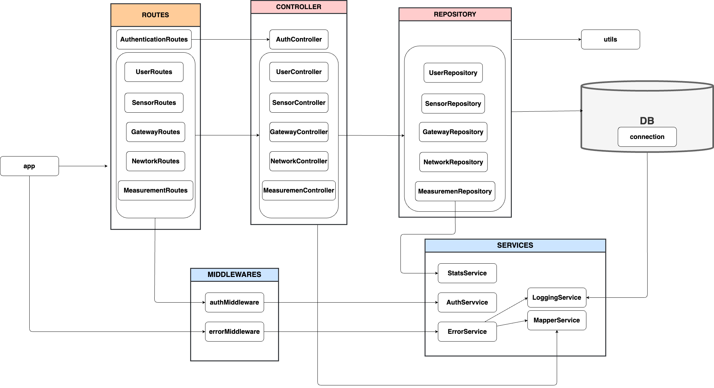

# Test Report

<The goal of this document is to explain how the application was tested, detailing how the test cases were defined and what they cover>

# Contents

- [Test Report](#test-report)
- [Contents](#contents)
- [Dependency graph](#dependency-graph)
- [Integration approach](#integration-approach)
- [Tests](#tests)
- [Coverage](#coverage)
  - [Coverage of FR](#coverage-of-fr)
  - [Coverage white box](#coverage-white-box)

# Dependency graph

<!-- # Integration approach

    <Write here the integration sequence you adopted, in general terms (top down, bottom up, mixed) and as sequence

    (ex: step1: unit A, step 2: unit A+B, step 3: unit A+B+C, etc)>

    <Some steps may  correspond to unit testing (ex step1 in ex above)>

    <One step will  correspond to API testing, or testing unit route.js>

    Ecco la conversione del testo in markdown semplice seguendo lo stile richiesto:

--- -->

# Integration Approach

The integration strategy we've adopted for testing the GeoControl API follows a **top-down** approach. This method prioritizes end-to-end (E2E) testing to validate the most common user scenarios using real data. After confirming the main user flows work as expected, we've moved to integration and unit tests to verify individual components and their interactions. This incremental approach allowed us to ensures reliability at each layer before moving to the next.

# Integration Sequence

1. **Step 1** – End-to-End Tests: *route + controller + repository + middleware + service*

   The first step involved writing E2E tests for the main API endpoints (e.g., `/networks`, `/networks/{networkCode}/gateways`, `/networks/{networkCode}/gateways/{gatewayMac}/sensors`, etc.). These tests simulate real HTTP requests using Supertest, covering authentication, authorization, input validation, and full flow from the API layer to the database. The Express routes were tested through simulated requests, validating role-based access, input correctness, and response behavior, focusing on common user scenarios with realistic data.

2. **Step 2** – Integration Tests: *controller + repository* and *routes + service + middleware*

   After E2E validation, we moved on to integration test, which can be divided in two main categories:

   - ***test/integration/controllers*** - first we dedicated ourselves on testing how *controllers and repositories* behave when used together. This has been achieved by mocking the DB connection while keeping the actual implementation of the repositories. We focused on verifying the behavior of controller methods in response to various scenarios (e.g., missing network/gateway/sensor, or correct data flow), using mocked database responses to simulate different edge cases. Particular effort was spent on testing *MeasurementController*, its corresponding repository and the related *statsService*, as these components were identified as critical. We decided it was appropriate for *measurementController.integration.test.ts* to cover the interaction between all three, ensuring they work seamlessly together.

   - ***test/integration/routes*** - we also tested how routes and middleware behave in a controlled environment by sending requests to real endpoints using an initialized Express server. Both the authentication service and the controller logic were mocked, allowing us to isolate and validate the routing layer, authorization flow, and error handling mechanisms.

3. **Step 3** – Unit Tests: repositories and utility functions

   Eventually, we moved on to unit testing, focussing primarily on repositories and services, as they contain the core business logic. Repositories were tested using an in-memory database to validate data access, while services were tested in isolation, often with mocked dependencies, to verify their logic independently.

   Once these critical layers were covered, we wrote additional unit tests for remaining utility functions or uncovered components to ensure full coverage.

   This approach ensured reliable testing of the application’s foundation, leading to **over 99% code coverage** with full function validation.

# Tests

## Unit Tests

Unit Tests were grouped according to the function tested. Each suite focuses on verifying the correctness of individual functions, services, or repository methods in isolation, using either mocked dependencies or an in-memory SQLite database. Mocked tests use dependency injection and Jest mocks to isolate the function under test, while database tests verify real data persistence and retrieval logic. The tests cover all main business logic, data transformations, error handling, and edge cases for each function. This approach ensures that each unit of the application behaves as expected independently from the rest of the system.

### Repository

| Test case name                                        | Object(s) tested      | Test level |    Technique used    |
| :---------------------------------------------------- | :-------------------- | :--------: | :------------------: |
| NetworkRepository - getAllNetworks                    | NetworkRepository     |    Unit    | WB / branch coverage |
| NetworkRepository - createNetwork                     | NetworkRepository     |    Unit    | WB / branch coverage |
| NetworkRepository - getNetworkByCode                  | NetworkRepository     |    Unit    | WB / branch coverage |
| NetworkRepository - updateNetwork                     | NetworkRepository     |    Unit    | WB / branch coverage |
| NetworkRepository - deleteNetwork                     | NetworkRepository     |    Unit    | WB / branch coverage |
| GatewayRepository - getAllGateways                    | GatewayRepository     |    Unit    | WB / branch coverage |
| GatewayRepository - getGatewayByMacAddress            | GatewayRepository     |    Unit    | WB / branch coverage |
| GatewayRepository - createGateway                     | GatewayRepository     |    Unit    | WB / branch coverage |
| GatewayRepository - updateGateway                     | GatewayRepository     |    Unit    | WB / branch coverage |
| GatewayRepository - deleteGateway                     | GatewayRepository     |    Unit    | WB / branch coverage |
| SensorRepository - getAllSensors                      | SensorRepository      |    Unit    | WB / branch coverage |
| SensorRepository - createSensor                       | SensorRepository      |    Unit    | WB / branch coverage |
| SensorRepository - getSensorByMacAddress              | SensorRepository      |    Unit    | WB / branch coverage |
| SensorRepository - updateSensor                       | SensorRepository      |    Unit    | WB / branch coverage |
| SensorRepository - deleteSensor                       | SensorRepository      |    Unit    | WB / branch coverage |
| UserRepository - getAllUsers                          | UserRepository        |    Unit    | WB / branch coverage |
| UserRepository - createUser                           | UserRepository        |    Unit    | WB / branch coverage |
| UserRepository - getUserByUsername                    | UserRepository        |    Unit    | WB / branch coverage |
| UserRepository - deleteUser                           | UserRepository        |    Unit    | WB / branch coverage |
| MeasurementRepository - createMeasurement             | MeasurementRepository |    Unit    | WB / branch coverage |
| MeasurementRepository - getSensorMeasurements         | MeasurementRepository |    Unit    | WB / branch coverage |
| MeasurementRepository - getSensorStats                | MeasurementRepository |    Unit    | WB / branch coverage |
| MeasurementRepository - getSensorsNetworkMeasurements | MeasurementRepository |    Unit    | WB / branch coverage |
| MeasurementRepository - getSensorsNetworkStats        | MeasurementRepository |    Unit    | WB / branch coverage |
| MeasurementRepository - getSensorOutliers             | MeasurementRepository |    Unit    | WB / branch coverage |
| MeasurementRepository - getSensorsNetworkOutliers     | MeasurementRepository |    Unit    | WB / branch coverage |

### Service

| Test case name                                                | Object(s) tested   | Test level |    Technique used    |
| :------------------------------------------------------------ | :----------------- | :--------: | :------------------: |
| MapperService - createErrorDTO                                | MapperService      |    Unit    | WB / branch coverage |
| MapperService - createTokenDTO                                | MapperService      |    Unit    | WB / branch coverage |
| MapperService - createUserDTO & mapUserDAOToDTO               | MapperService      |    Unit    | WB / branch coverage |
| MapperService - createSensorDTO & mapSensorDAOToDTO           | MapperService      |    Unit    | WB / branch coverage |
| MapperService - createGatewayDTO & mapGatewayDAOToDTO         | MapperService      |    Unit    | WB / branch coverage |
| MapperService - createNetworkDTO & mapNetworkDAOToDTO         | MapperService      |    Unit    | WB / branch coverage |
| MapperService - createMeasurementDTO & mapMeasurementDAOToDTO | MapperService      |    Unit    | WB / branch coverage |
| MeasurementService - findMean                                 | MeasurementService |    Unit    | WB / branch coverage |
| MeasurementService - findVariance                             | MeasurementService |    Unit    | WB / branch coverage |
| MeasurementService - findOutliers                             | MeasurementService |    Unit    | WB / branch coverage |
| MeasurementService - createStats                              | MeasurementService |    Unit    | WB / branch coverage |
| MeasurementService - createOnlyOutliers                       | MeasurementService |    Unit    | WB / branch coverage |
| MeasurementService - createStatsFromArray                     | MeasurementService |    Unit    | WB / branch coverage |
| AuthService - generateToken                                   | AuthService        |    Unit    | WB / branch coverage |
| AuthService - processToken                                    | AuthService        |    Unit    | WB / branch coverage |

### Controller

| Test case name                                 | Object(s) tested      | Test level |    Technique used    |
| :--------------------------------------------- | :-------------------- | :--------: | :------------------: |
| NetworkController - getAllNetworks             | NetworkController     |    Unit    | WB / branch coverage |
| NetworkController - getNetworkByCode           | NetworkController     |    Unit    | WB / branch coverage |
| NetworkController - createNewNetwork           | NetworkController     |    Unit    | WB / branch coverage |
| NetworkController - updateNetwork              | NetworkController     |    Unit    | WB / branch coverage |
| NetworkController - deleteNetwork              | NetworkController     |    Unit    | WB / branch coverage |
| GatewayController - getAllGateways             | GatewayController     |    Unit    | WB / branch coverage |
| GatewayController - getGateway                 | GatewayController     |    Unit    | WB / branch coverage |
| GatewayController - createGateway              | GatewayController     |    Unit    | WB / branch coverage |
| GatewayController - updateGateway              | GatewayController     |    Unit    | WB / branch coverage |
| GatewayController - deleteGateway              | GatewayController     |    Unit    | WB / branch coverage |
| SensorController - getAllSensors               | SensorController      |    Unit    | WB / branch coverage |
| SensorController - getSensor                   | SensorController      |    Unit    | WB / branch coverage |
| SensorController - createSensor                | SensorController      |    Unit    | WB / branch coverage |
| SensorController - updateSensor                | SensorController      |    Unit    | WB / branch coverage |
| SensorController - deleteSensor                | SensorController      |    Unit    | WB / branch coverage |
| MeasurementController - createMeasurement      | MeasurementController |    Unit    | WB / branch coverage |
| MeasurementController - getSensorMeasurements  | MeasurementController |    Unit    | WB / branch coverage |
| MeasurementController - getSensorStats         | MeasurementController |    Unit    | WB / branch coverage |
| MeasurementController - getSensorOutliers      | MeasurementController |    Unit    | WB / branch coverage |
| MeasurementController - getNetworkMeasurements | MeasurementController |    Unit    | WB / branch coverage |
| MeasurementController - getNetworkStats        | MeasurementController |    Unit    | WB / branch coverage |
| MeasurementController - getNetworkOutliers     | MeasurementController |    Unit    | WB / branch coverage |
| UserController - getAllUsers                   | UserController        |    Unit    | WB / branch coverage |
| UserController - createUser                    | UserController        |    Unit    | WB / branch coverage |
| UserController - deleteUser                    | UserController        |    Unit    | WB / branch coverage |
| AuthController - login                         | AuthController        |    Unit    | WB / branch coverage |

### Middleware

| Test case name                     | Object(s) tested | Test level |    Technique used    |
| :--------------------------------- | :--------------- | :--------: | :------------------: |
| Middleware - authenticateUser      | Authentication   |    Unit    | WB / branch coverage |
| Middleware - adminOnly             | Authentication   |    Unit    | WB / branch coverage |
| Middleware - validateRequestBody   | Validation       |    Unit    | WB / branch coverage |
| Middleware - validateRequestParams | Validation       |    Unit    | WB / branch coverage |
| Middleware - errorHandler          | ErrorHandling    |    Unit    | WB / branch coverage |
| Middleware - notFound              | ErrorHandling    |    Unit    | WB / branch coverage |

### Controller

| Test case name          | Object(s) tested                | Test level |    Technique used    |
| :---------------------- | :----------------------------- | :--------: | :------------------: |
| Controller - authController | AuthController| Unit       | WB / branch coverage |

## Integration

Integration tests are designed to validate the interaction between different components of the system, such as routes, controllers, services, and the database, under realistic conditions.
The tests are organized by endpoint and assess how the system behaves across various scenarios, including different user roles, valid and invalid inputs, and expected responses (e.g., success, forbidden access, resource not found, or conflict).
Authentication and authorization are simulated using mocked tokens, while the database is initialized with predefined test data to ensure consistent and reliable results.

| Test case name | Object(s) tested | Test level | Technique used |
| :------------- | :--------------- | :--------: | :------------: |
| NetworkController integration| NetworkController, NetworkRepository, MapperService  | Integration | BB / equivalence partitioning |
| GatewayController integration|GatewayController, GatewayRepository, MapperService| Integration  | BB / equivalence partitioning |
| SensorController integration| SensorController, SensorRepository, MapperService | Integration  | BB / equivalence partitioning |
| MeasurementController integration| MeasurementController, MeasurementRepository, MapperService, StatsService | Integration  | BB / equivalence partitioning |
| UserController integration| UserController, UserRepository, MapperService| Integration  | BB / equivalence partitioning |
| NetworkRoutes integration|NetworkRoutes, AuthMiddleware, ErrorMiddleware, ErrorService, MapperService | Integration  | BB / equivalence partitioning |
| GatewayRoutes integration| GatewayRoutes, AuthMiddleware, ErrorMiddleware, ErrorService, MapperService| Integration  | BB / equivalence partitioning |
| SensorRoutes integration| SensorRoutes, AuthMiddleware, ErrorMiddleware, ErrorService, MapperService| Integration  | BB / equivalence partitioning |
| MeasurementRoutes integration| MeasurementRoutes, AuthMiddleware, ErrorMiddleware, ErrorService, MapperService   | Integration  | BB / equivalence partitioning |
| UserRoutes integration| UserRoutes, AuthMiddleware, ErrorMiddleware, ErrorService, MapperService| Integration  | BB / equivalence partitioning |

## E2E Tests

End-to-End (E2E) tests were grouped according to the module tested. Each suite exercises the full stack for its respective module, validating the integration of routes, controllers, repositories, services, and middleware. All E2E tests simulate real HTTP requests and validate the complete flow from the API layer to the database, including role-based access control and error scenarios. The test suites cover all main CRUD operations, input validation, and authorization logic for each module. The tests are designed as black-box (BB) tests using equivalence partitioning to cover typical and edge-case scenarios, including authentication, authorization, input validation, and error handling.

| Test case name | Object(s) tested | Test level | Technique used |
| :------------- | :--------------- | :--------: | :------------: |
| Network API (e2e) | networkRoutes, networkController, networkRepository, mapperService, errorService, authMiddleware                                                                       | API | BB/ eq partitioning |
| Gateway API (e2e) | gatewayRoute, gatewayController, networkRepository, gatewayRepository, mapperService, errorService, authMiddleware                                                     | API | BB/ eq partitioning |
| Sensor API (e2e) | sensorRoute, sensorController, sensorRepository, gatewayRepository, mapperService, errorService, authMiddleware                                                        | API | BB/ eq partitioning |
| Measurements API (e2e) | measurementRoutes, measurementController, measurementRepository, sensorRepository, networkRepository, mapperService, measurementsService, errorService, authMiddleware | API | BB/ eq partitioning |
| User API (e2e) | userRoutes, UserController, UserRepository, sensorRepository, mapperService, errorService, authMiddleware | API | BB/ eq partitioning |

# Coverage

## Coverage of FR

<!-- <Report in the following table the coverage of functional requirements and scenarios(from official requirements) > -->

| Functional Requirement or scenario                                                    | Test(s) |
| :------------------------------------------------------------------------------------:| :-----: |
| FR1 - Authentication Management                                                       |  6      |
| FR1.1 - Authenticate user and return a bearer token in case the credentials are valid |  13     |
| FR2 - Users Management                                                                |  20     |
| FR2.2 - Create a new user                                                             |  24     |
| FR2.3 - Retrieve a specific user                                                      |  14     |
| FR3 - Networks Management                                                             |  9      |
| FR3.1 - Retrieve all networks                                                         |  16     |
| FR3.2 - Create a new network                                                          |  19     |
| FR3.3 - Retrieve a specific network                                                   |  16     |
| FR3.4 - Update a network                                                              |  28     |
| FR3.5 - Delete a network                                                              |  19     |
| FR4 - Gateway Management                                                              |  3      |
| FR4.1 - Retrieve all gateways for a network                                           |  21     |
| FR4.2 - Create a new gateway for a network                                            |  29     |
| FR4.3 - Retrieve a specific gateway                                                   |  28     |
| FR4.4 - Update a gateway                                                              |  27     |
| FR4.5 - Delete a gateway                                                              |  19     |
| FR5 - Sensors Management                                                              |  9      |
| FR5.1 - Retrieve all sensors for a gateway                                            |  13     |
| FR5.2 - Create a new sensor for a gateway                                             |  16     |
| FR5.3 - Retrieve a specific sensor                                                    |  13     |
| FR5.4 - Update a sensor                                                               |  15     |
| FR5.5 - Delete a sensor                                                               |  14     |
| FR6 - Measures Management                                                             |  10     |
| FR6.1 - Retrieve measurements for a set of sensors of a specific network              |  22     |
| FR6.2 - Retrieve only statistics for a set of sensors of a specific network           |  19     |
| FR6.3 - Retrieve only outliers measurements for a set of sensors of a specific network| 19      |
| FR6.4 - Store measurements for a sensor                                               |  18     |
| FR6.5 - Retrieve measurements for a specific sensor                                   |  17     |
| FR6.6 - Retrieve statistics for a specific sensor                                     |  17     |
| FR6.7 - Retrieve only outliers measurements for a specific sensor                     |  18     |
| FR7 - Calculations and Statistical Analysis                                           |  4      |
| FR7.1 - Calculate mean and variance of measurements over a given time span            |  3      |
| FR7.2 - Calculate thresholds (upper and lower) to identify potential anomalous values |  3      |
| FR7.3 - Calculate outliers                                                            |  4      |

## Coverage white box

<!-- Report here the screenshot of coverage values obtained with jest-- coverage -->

