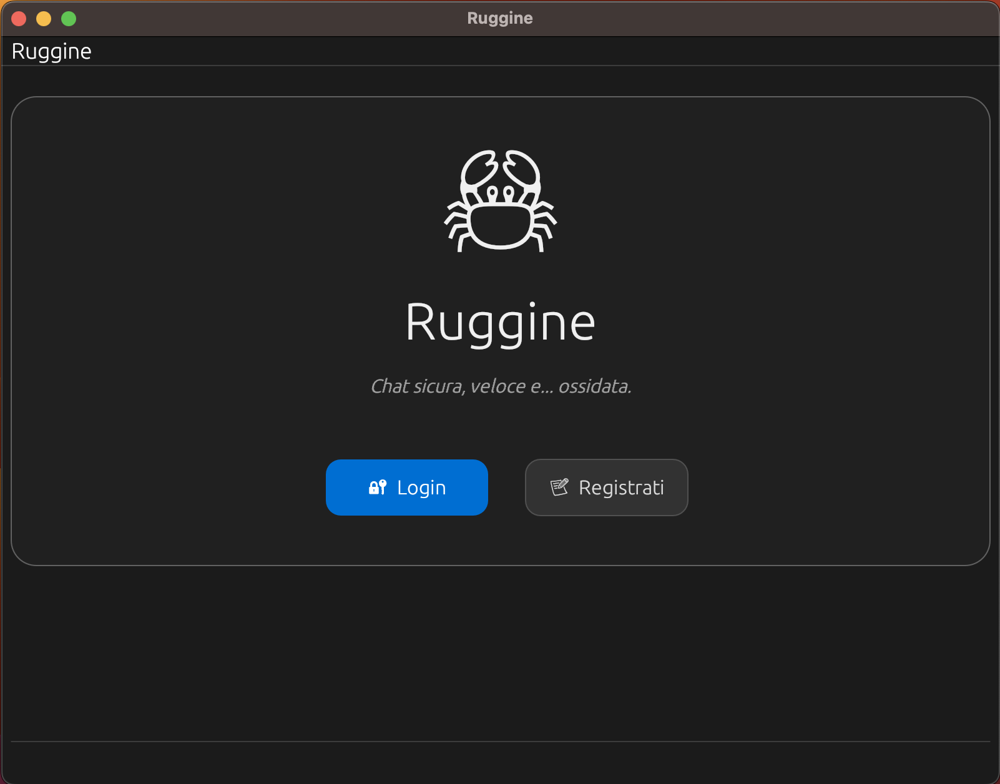
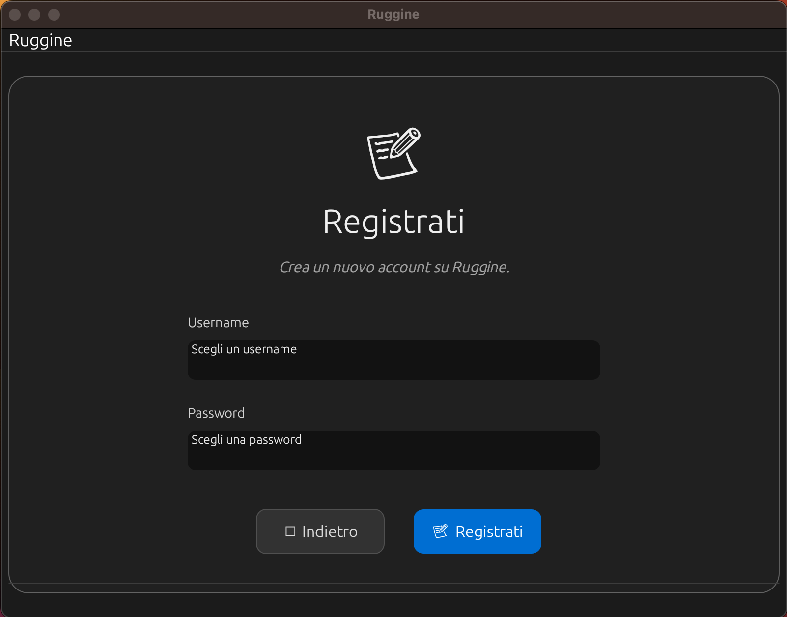
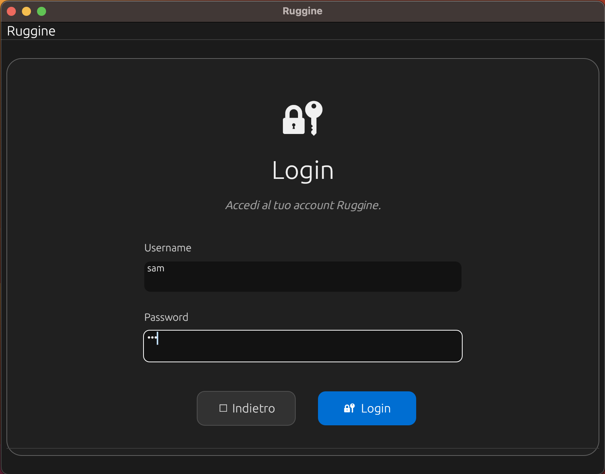
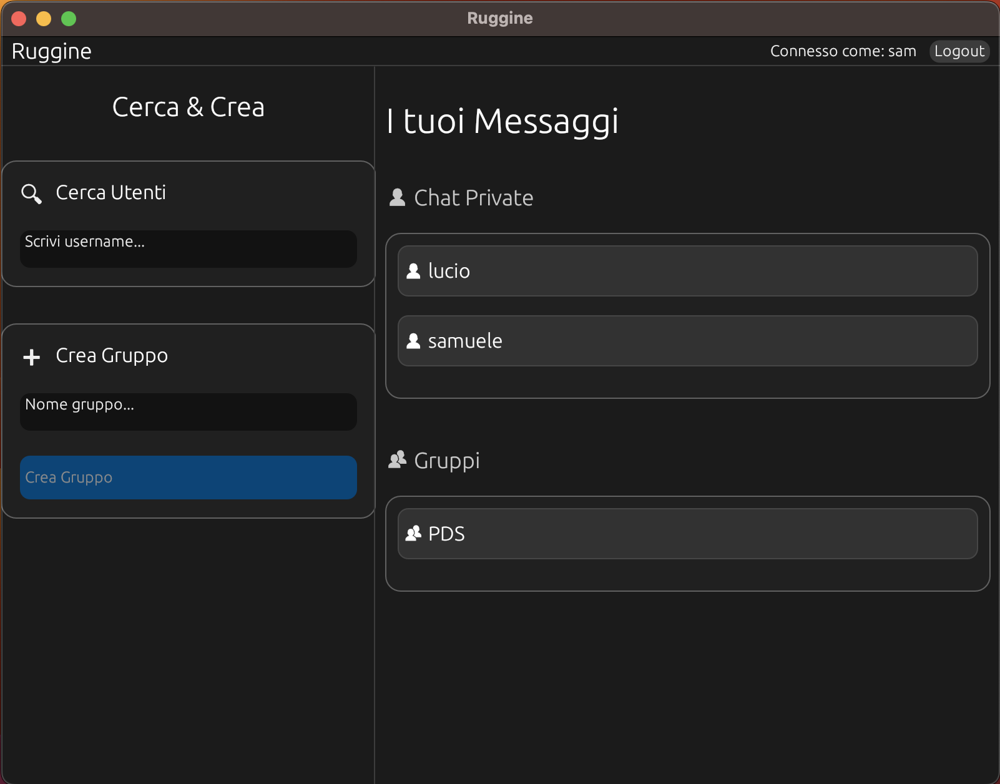
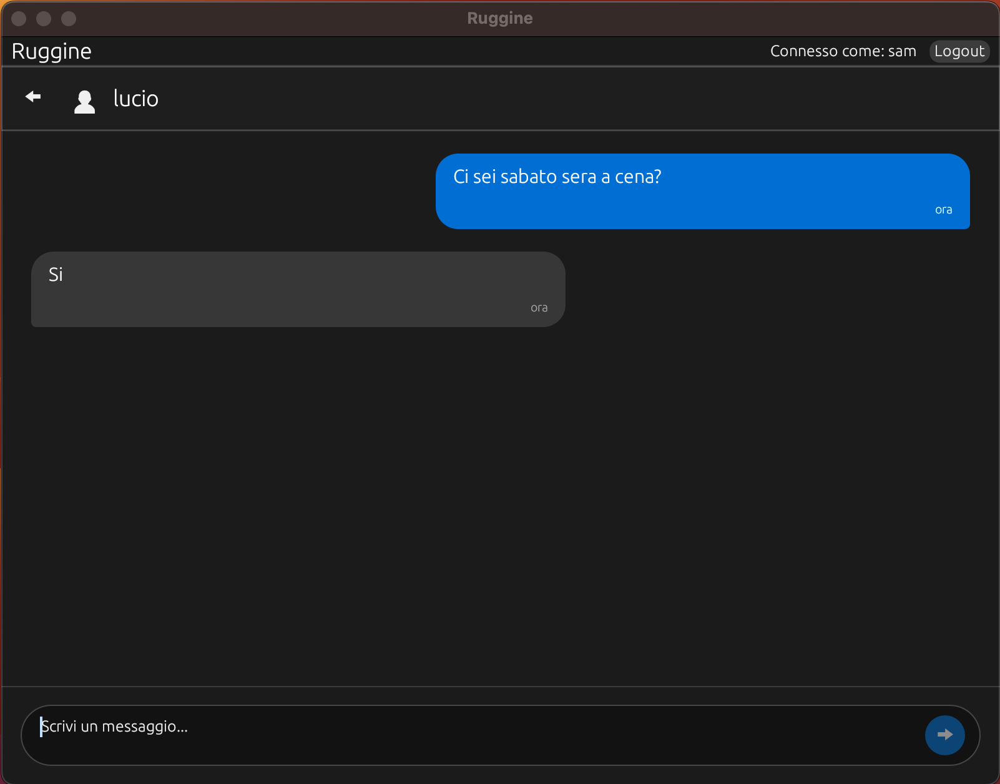
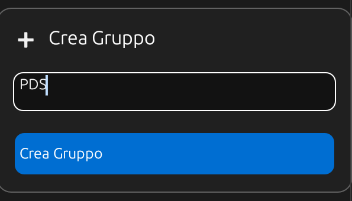
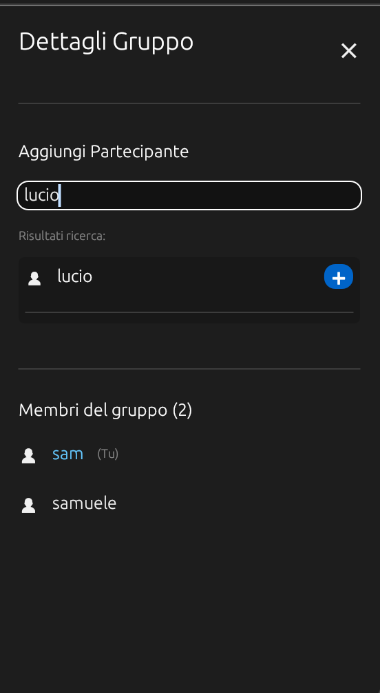
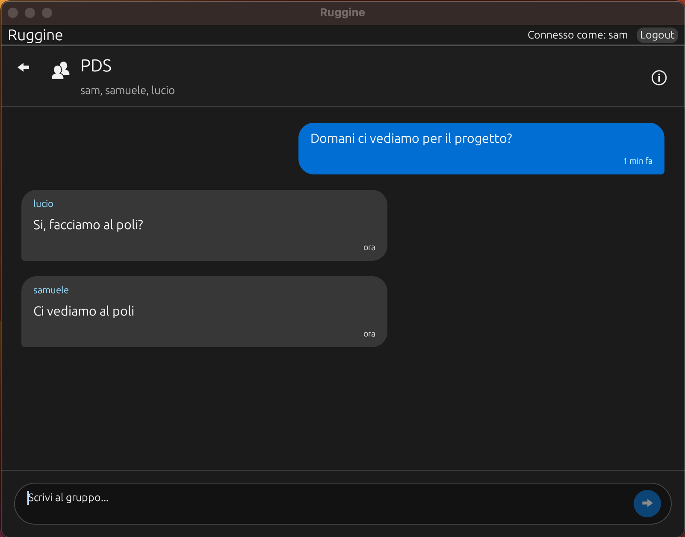

# User Manual - Ruggine

## Table of Contents

- [Introduction](#introduction)
  - [Server](#server)
  - [Client](#client)
- [Starting the application](#starting-the-application)
  - [Terminal 1 – Starting the server](#terminal-1---starting-the-server)
  - [Terminal 2 – Starting the client](#terminal-2---starting-the-client)
- [Client](#client-1)
  - [Registration](#registration)
  - [Login](#login)
  - [Home page](#home-page)
    - [User search and private chat creation](#user-search-and-private-chat-creation)
    - [Group creation and invitation](#group-creation-and-invitation)
- [Log files](#log-files)
- [Generating and running executables](#generating-and-running-executables)
  - [Generating executables](#generating-executables)
  - [Running executables](#running-executables)


## Introduction

The **Ruggine** application is a **client–server** messaging platform built in **Rust**, 
designed to support private chats, group chats, and real-time push notifications.

It consists of **two distinct components**, each with specific responsibilities and connected to each other 
through a protocol based on JSON messages encapsulated in frames using **LengthDelimitedCodec**.

---

### Server

The server is a **command-line** application based on **Tokio** and designed to handle:

- **TCP connections** (port 7878)
- **User registration and authentication**
- **Private and group chats**
- **Push notification sending** via `PeerMap`
- **Data persistence** via `SqliteStorage`

### Client

The client is a desktop application with a **graphical user interface (GUI)** developed using **egui** via `eframe`.

It allows users to:

- Register and authenticate via the server
- View private and group chats
- Send and receive messages
- Receive push notifications via an asynchronous task
- Interact with backend logic through a network wrapper (`net.rs` on the client side)

Communication between client and server is asynchronous, structured, and robust thanks to Tokio, 
framed codecs, SQLite, and careful session management via `PeerMap`.

## Starting the application

The application requires the use of at least two terminals to function properly.

### Terminal 1 - Starting the server

- Terminal open in the application folder
- Type the command:
    ```bash
    cargo run -p server
    ```

### Terminal 2 - Starting the client

- Terminal open in the application folder
- Type the command:
    ```bash
    cargo run -p client
    ```
- Each client requires a separate terminal to start

## Client
When the application starts, the login page is displayed,
with two options:
- `Login`
- `Sign up`



### Registration
From the login screen, by clicking the 'Sign up' button, you are directed
to the registration page, where the following fields must be filled in:
- ***username*** unique
- ***password*** of your choice

There are two possible outcomes of this operation:
- **Registration successful:** the login page is shown again, where you will be asked to log in
- **Error:** an error message is displayed (e.g. 'Empty input', 'Username already in use', etc)



### Login
By clicking the 'Sign up' button, you are directed to the registration page where
the following fields must be filled in:
- ***username***
- ***password***

There are two possible outcomes of this operation:
- **Successful login:** the application 'home page' is displayed
- **Error:** an error message is displayed (e.g. 'Invalid credentials', etc)



### Home page
The home page displays the following screens:
- **Logout**: button in the top right to log out of the application
- **Search users**: where you can enter the username to search for to create a private chat
- **Private chats**: list of active private chats
- **Create group**: where you can enter the group name and proceed with creation
- **Groups**: list of groups the logged-in user is a member of



#### User search and private chat creation
From the home page:
- In the **Search users** box, enter the username you want to chat with
- During the search, usernames will appear as a list
- To the right of the user in the list, there will be a 'message' icon
- Once you click the icon, the user will be displayed in the private chats list
- Clicking on the user in the private chats list will display the chat screen
- From this screen you can:
  - return to the home page
  - write a message and send it by pressing 'Enter' or the appropriate send icon




#### Group creation and invitation
From the home page:
- In the **Create group** box, enter the group name
- Click the 'Create group' button
- The group name will appear in the 'Groups' list on the home page
- Clicking on the name from the list will display the group chat
- From this screen you can:
    - return to the home page
    - click the 'info' button to:
        - view group members
        - invite members by searching for the username (the user will be added automatically and will see the group name on their home page under **Groups**)
    - write messages and send them by pressing 'Enter' or the appropriate send icon





## Log files

During server execution, every 120 seconds, the monitoring routine adds a log line to **server_cpu_log.txt**.
Each line contains a timestamp and the CPU usage percentage, e.g:
`[2025-11-25 12:06:28] CPU Usage: 0.94%`

## Generating and running executables

### Generating executables

With the terminal open in the project's main folder, execute the following commands:
    ```bash
    cargo build -p server --release
    cargo build -p client --release
    ```

Once compilation is complete, the executables will be available at the following paths:
    - `target/release/server`
    - `target/release/client`

### Running executables

With the terminal open in the project's main folder, execute the following commands:
    ```bash
    cargo run -p server --release
    cargo run -p client --release
    ```

