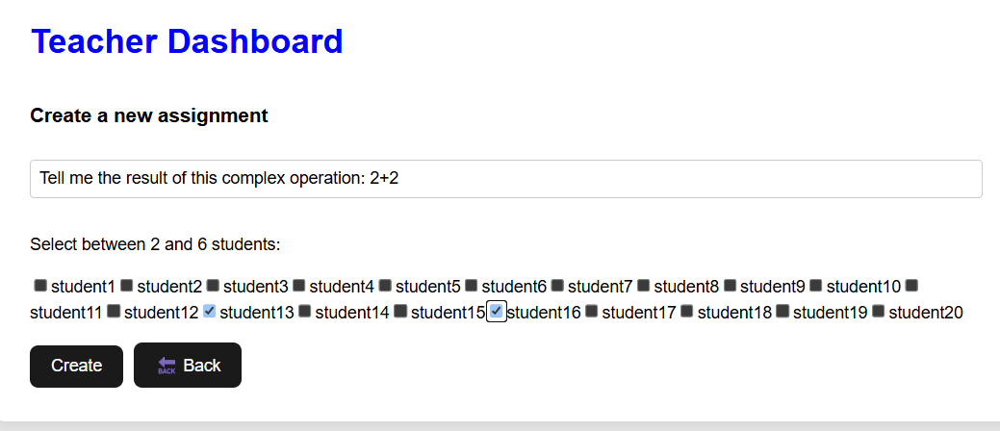
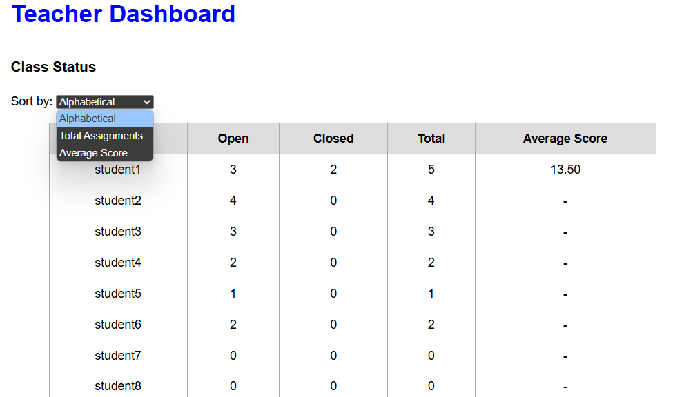

# Exam #2: "Class Assignments"
## Student: s348016 Fuoco Lucio

## React Client Application Routes

- Route/Login page.  
  +Allows students and faculty to log in. The system recognizes the role and redirects to the corresponding dashboard.

- Route/student: Student dashboard.  
  +Displays open and closed assignments. It allows the insertion or update of answers and shows the received votes.

- Route/teacher: Teacher dashboard.  
  +Allows the creation of new assignments, evaluation of open ones and consultation of class status.

- Logout: managed through the ‘LogoutButton’ component, which performs a POST and redirects to login.

## API Server

# Authentication
  -POST /api/auth/login
    -body: { username: string, password: string }
    -return: { id, username, role }

  -POST /api/auth/logout
    -body:No parameter
    -return: { message: 'Logout successful' }, destroys the session

  -GET /api/auth/check
    -body:No parameter
    -return authenticated user if logged in, 401 otherwise

# Assignments 
  -POST /api/assignments
    -body: { question: string, studentIds: number[] }
    -return: { assignmentId } or warning if already existing
    -Create a new assignment for a group (between 2 and 6 students), avoiding   duplicates

  -POST /api/assignments/:id/evaluate
    -path parameter: id = assignmentId
    -body: { score: number } (between 0 and 30)
    -return: success message
    -Evaluate an assignment only if at least one student has responded

  -GET /api/assignments/open
    -body: No parameter
    -return: all open assignments where the logged-in student is involved
    -Used by students to view their current active assignments

  -GET /api/assignments/open/teacher
    -body: No parameter
    -return: all open assignments created by the logged teacher, with number of replies received

  -GET /api/assignments/all
    -body:No parameter
    -return: all assignments (open or closed) for the student logged in, with possible evaluation

# Answers 
  -POST /api/answers/:assignmentId
    -path parameter: assignmentId
    -body: { answerText: string }
    -return: success message
    -Inserts or updates a response for the student if he is in the group

  -GET /api/answers/:assignmentId
    -path parameter: assignmentId
    -body: No parameters
    -return: { assignmentId, answerText, submittedBy } or {}
    -The teacher can always see, the student only if part of the group

# Status of the Class (Class)
  -GET /api/class/status? sort=username|total|average
    -body: optional sort (username default)
    -return: student array with open/closed assignment count and weighted average

# Ratings (Evaluations)
  -GET /api/evaluations/me
    -body:No parameter
    -return:The logged-in student receives received ratings and weighted average

  -GET /api/user/:id/evaluations
    -path parameter: id = studentId
    -body: No parameters
    -return: received ratings and weighted average
    -Accessible by the student himself or a teacher
# Users
  -GET /api/user/students
    -Access: only for teachers
    -Return: list of all students with their id and username

## Database Tables

- Table `Users` - contains login credentials and role (student or teacher)
- Table `Assignments` - stores each assignment's question, teacher, and status (open/closed)
- Table `Groups` - associates students with assignments (many-to-many relationship)
- Table `Answers` - stores the text answer submitted for an assignment by one member of the student group. Each assignment has at most one answer.
- Table `Evaluations` - stores the final score given by the teacher to a group assignment

## Main React Components
- `App` (in `App.jsx`): main component that handles routing. Defines the login, student, and teacher routes using `ProtectedRoute`.

- `LoginPage` (in `loginPage.jsx`): renders the login form and handles user authentication. On successful login, stores the user in context and redirects to the appropriate dashboard.

- `StudentDashboard` (in `studentDashboard.jsx`): main interface for students. Allows viewing open assignments, submitting/updating answers, and checking evaluations.

- `TeacherDashboard` (in `teacherDashboard.jsx`): main interface for teachers. Allows creating assignments by selecting a question and a group of 2–6 students, viewing open assignments created by them, reviewing answers, inserting scores, and checking class statistics with sorting options.

- `ProtectedRoute` (in `ProtectedRoute.jsx`): wraps restricted routes. Ensures that only authenticated users can access specific pages. Redirects to the login page if no user is found.

- `UserContext` (in `userContext.jsx`): provides global user data (id, username, role) using React Context API. Used across the application.
 Defines the routes for login, teacher dashboard, and student dashboard, and uses `ProtectedRoute` to restrict access based on authentication.

## Screenshots

### Assignment Creation

### Class Status

## Users Credentials

#Teachers
  - lucio, password123 (Teacher) 
  - teacher2, password456 (Teacher)

#Students
  - student1, pass123, (Student) 
  - student2, pass123, (Student) 
  - student3, pass123, (Student)
  - student4, pass123, (Student)
  - student5, pass123, (Student)
  - student6, pass123, (Student)
  - student7, pass123, (Student)
  - student8, pass123, (Student)
  - student9, pass123, (Student)
  - student10, pass123, (Student)
  - student11, pass123, (Student)
  - student12, pass123, (Student)
  - student13, pass123, (Student)
  - student14, pass123, (Student) 
  - student15, pass123, (Student) 
  - student16, pass123, (Student) 
  - student17, pass123, (Student)
  - student18, pass123, (Student) 
  - student19, pass123, (Student) 
  - student20, pass123, (Student)

> These accounts are created automatically only if the database is newly initialized and the usernames do not already exist.