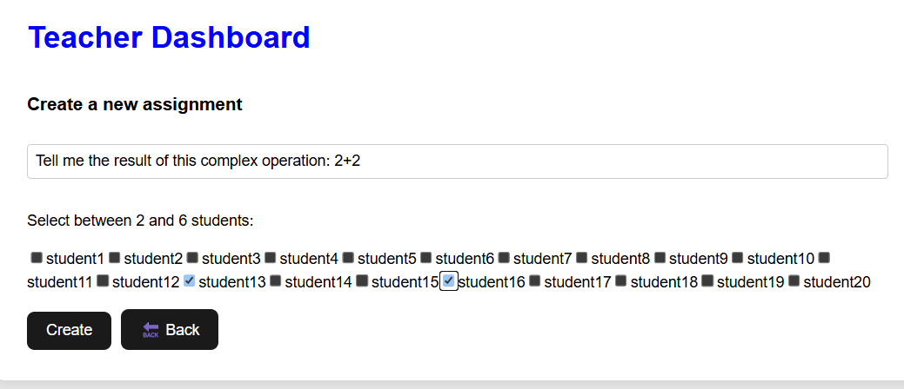
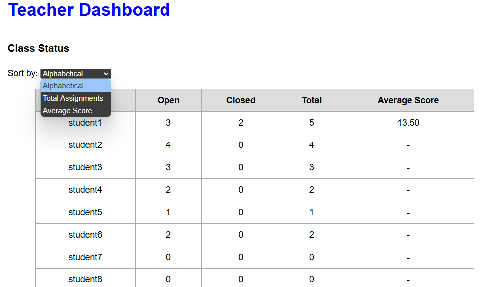

# Exam #2: "Class Assignments"
## Student: s348016 Fuoco Lucio

## React Client Application Routes

- Route/Login page.  
  +Consente a studenti e docenti di accedere. Il sistema riconosce il ruolo e reindirizza alla dashboard corrispondente.

- Route/student: Student dashboard.  
  +Visualizza le assegnazioni aperte e chiuse. Permette l'inserimento o l'aggiornamento delle risposte e mostra i voti ricevuti.

- Route/teacher: Teacher dashboard.  
  +Consente la creazione di nuovi incarichi, la valutazione di quelli aperti e la consultazione dello stato della classe.

- Logout: gestito tramite il componente ‘LogoutButton’, che esegue un POST e reindirizza all'accesso.

## API Server

# Authentication
  -POST /api/auth/login
    -corpo: { username: string, password: string }
    -restituisci: { id, username, role }

  -POST /api/auth/logout
    -corpo:Nessun parametro
    -restituisci: { message: 'Logout successful' }, elimina la sessione

  -GET /api/auth/check
    -corpo:Nessun parametro
    -restituisci: utente autenticato se hai effettuato l'accesso, 401 altrimenti

# Assignments 
  -POST /api/assignments
    -corpo: { question: string, studentIds: number[] }
    -restituisci: { assignmentId } o avviso se già esistente
    -Crea un nuovo assignment per un gruppo (formato tra 2 e 6 studenti), evitando duplicati

  -POST /api/assignments/:id/evaluate
    -path parameter: id = assignmentId
    -corpo: { score: number } (tra 0 e 30)
    -restituisce:messaggio di successo
    -Dai una valutazione ad un assignment solo se almeno uno studente appartenente al gruppo ha dato una risposta

  -GET /api/assignments/open
    -corpo:Nessun parametro
    -restituisci:tutti gli assignments aperti dove lo studente che ha effettuato log-in è coinvolto
    -Usato dagli studenti per vedere tutte gli assignment attivi in cui è coinvolto

  -GET /api/assignments/open/teacher
    -corpo:Nessun parametro
    -restituisci:tutti gli assignments aperti creati dal docente loggato, con le risposte ricevute

  -GET /api/assignments/all
    -corpo:Nessun parametro
    -restituisce:tutti gli assignments (aperti o chiusi) per lo studente loggato, eventualmete con valutazione

# Answers 
  -POST /api/answers/:assignmentId
    -path parameter: assignmentId
    -corpo: { answerText: string }
    -restituisce:messaggio di successo
    -Inserisci o aggiorna una risposta da parte dello studente che si trova nel gruppo

  -GET /api/answers/:assignmentId
    -path parameter: assignmentId
    -corpo:Nessun parametro
    -restituisce: { assignmentId, answerText, submittedBy } o {}
    -Il docente può sempre vederlo, lo studente soltanto se è un partecipante del gruppo

# Status of the Class (Class)
  -GET /api/class/status? sort=username|total|average
    -corpo: ordinamento opzionale (di solito fatto in ordine alfabetico)
    -restituisce: vettore di studenti con conto degli assignment aperti/chiusi e media 

# Ratings (Evaluations)
  -GET /api/evaluations/me
    -corpo:Nessun parametro
    -restituisce:Lo studente che ha effettuato log-in visualizza i suoi voti e la sua media

  -GET /api/user/:id/evaluations
    -path parameter: id = studentId
    -corpo: Nessun parametro
    -rescituisce: voti rivecuti e media
    -Accessibbile dagli studenti stessi o dal docente
# Users
  -GET /api/user/students
    -Accesso: permesso solo ai docenti
    -Restituisce: lista di tutti gli studenti con Identificativo e username

## Database Tables

- Tabella `Users` - contiene le credenziali di accesso e il ruolo (studente o insegnante)
- Tabella `Assignments` - memorizza la domanda, l'insegnante e lo stato di ogni compito (aperto/chiuso)
- Tabella `Groups` - associa gli studenti ai compiti (relazione molti-a-molti)
- Tabella `Answers`: memorizza la risposta testuale inviata per un compito da un membro del gruppo di studenti. Ogni compito ha al massimo una risposta.
- Tabella `Evaluations` - memorizza il punteggio finale assegnato dall'insegnante a un compito di gruppo

## Main React Components
- `App` (in `App.jsx`): componente principale che gestisce il routing. Definisce i percorsi di accesso, studenti e insegnanti utilizzando `ProtectedRoute`.

- `LoginPage` (in `loginPage.jsx`): esegue il rendering del modulo di accesso e gestisce l'autenticazione dell'utente. In caso di accesso riuscito, memorizza l'utente nel contesto e reindirizza alla dashboard appropriata.

- `StudentDashboard` (in `studentDashboard.jsx`): interfaccia principale per gli studenti. Consente di visualizzare i compiti aperti, inviare/aggiornare le risposte e controllare le valutazioni.

- `TeacherDashboard` (in `teacherDashboard.jsx`): interfaccia principale per gli insegnanti. Consente di creare compiti selezionando una domanda e un gruppo di 2–6 studenti, visualizzando i compiti aperti da loro creati, rivedendo le risposte, inserendo punteggi e controllando le statistiche della classe con opzioni di ordinamento.

- `ProtectedRoute` (in `ProtectedRoute.jsx`): avvolge percorsi limitati. Garantisce che solo gli utenti autenticati possano accedere a pagine specifiche. Reindirizza alla pagina di accesso se non viene trovato alcun utente.

- `UserContext` (in `userContext.jsx`): fornisce dati utente globali (id, nome utente, ruolo) utilizzando React Context API. Utilizzato in tutta l'applicazione.
 Definisce i percorsi per l'accesso, la dashboard dell'insegnante e la dashboard dello studente e utilizza `ProtectedRoute` per limitare l'accesso in base all'autenticazione.

## Screenshots

### Assignment Creation

### Class Status

## Users Credentials

#Teachers
  - lucio, password123 (Teacher) 
  - teacher2, password456 (Teacher)

#Students
  - student1, pass123, (Student) 
  - student2, pass123, (Student) 
  - student3, pass123, (Student)
  - student4, pass123, (Student)
  - student5, pass123, (Student)
  - student6, pass123, (Student)
  - student7, pass123, (Student)
  - student8, pass123, (Student)
  - student9, pass123, (Student)
  - student10, pass123, (Student)
  - student11, pass123, (Student)
  - student12, pass123, (Student)
  - student13, pass123, (Student)
  - student14, pass123, (Student) 
  - student15, pass123, (Student) 
  - student16, pass123, (Student) 
  - student17, pass123, (Student)
  - student18, pass123, (Student) 
  - student19, pass123, (Student) 
  - student20, pass123, (Student)

> Questi account vengono creati automaticamente solo se il database è stato appena inizializzato e i nomi utente non esistono già.